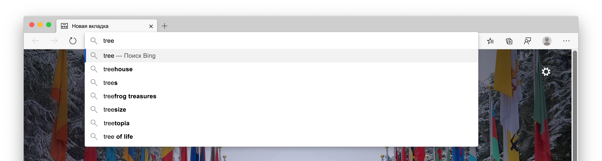
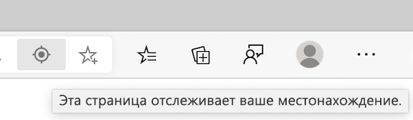
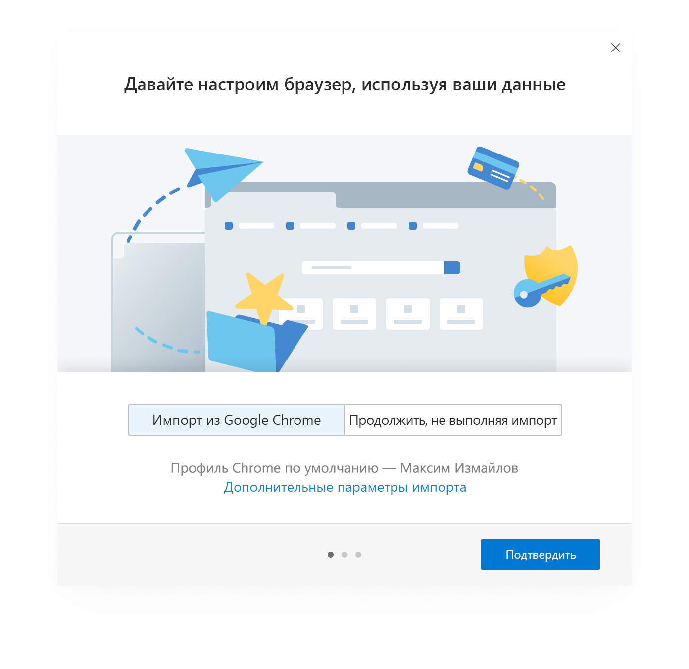
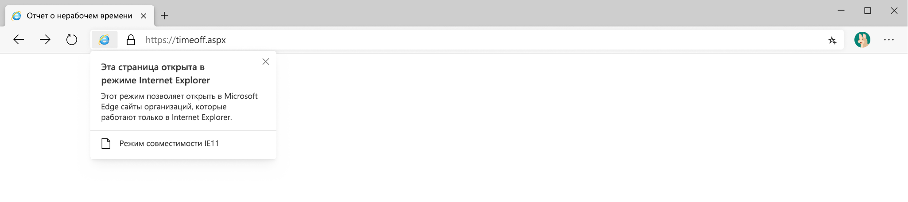
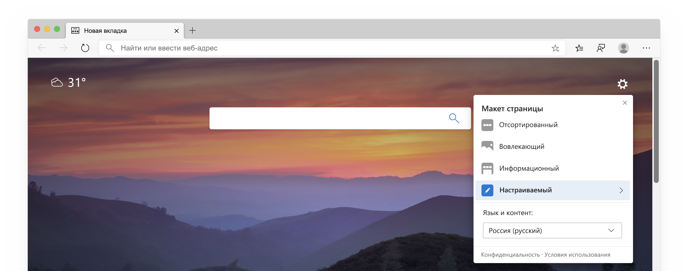
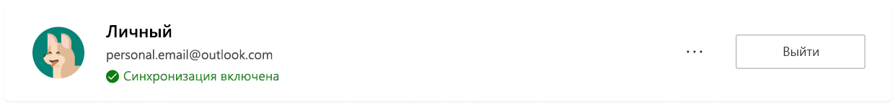
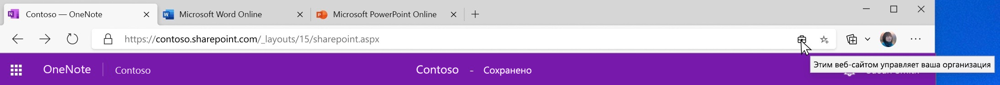

# Техническая документация по конфиденциальности Microsoft EdgeMicrosoft Edge Privacy Whitepaper  

Наше обеспечение безопасности в браузере – это предоставление вам возможности защиты, прозрачности, контроля и соблюдения требований.Our browser privacy promise is to provide you with the protection, transparency, control and respect you deserve.  Чтобы uphold обязательства по обеспечению прозрачности продуктов Майкрософт, группа Microsoft Edge предоставляет документ, в котором объясняется, как работают возможности и службы Microsoft EDGE и как они влияют на вашу конфиденциальность.To uphold commitments to give you transparency into Microsoft products, the Microsoft Edge team provided a privacy whitepaper that explains how Microsoft Edge features and services work and how each may affect your privacy.  Цель группы Microsoft Edge — дать вам полное представление об использовании данных, управлять различными функциями и управлять собранными данными, чтобы получить сведения, необходимые вам для принятия необходимых вам решений о конфиденциальности.The goal of the Microsoft Edge team is to give you a full understanding into how your data is used, how to control the different features, and how to manage your collected data, so you have the info you need to make the right privacy decisions for you.  

В некоторых разделах бумаги в Microsoft Team содержатся инструкции по переходу на страницу параметров Microsoft EDGE и других страниц.In certain sections of the paper, the Microsoft Team provide steps to go to Microsoft Edge settings and other pages.  Для обеспечения единообразия Microsoft Edge использует сокращенный формат во всей статье: должны отобразиться URL-адреса, которые начинаются с `edge://` например `edge://favorites` или `edge://settings/privacy` .For consistency, the Microsoft edge team used a shortened format throughout the whitepaper: You should see URLs that begin with `edge://` such as `edge://favorites` or `edge://settings/privacy`.  Чтобы перейти к страницам, введите полужирный текст прямо в адресную строку Microsoft Edge.To go to the pages, type the bolded text directly into the Microsoft Edge address bar.  Эти страницы доступны только для просмотра в Microsoft Edge.These pages are only be viewable in Microsoft Edge.  

В техническом описании для классической версии Microsoft EDGE, а части бумаги могут быть функции или возможности, недоступные для всех пользователей.The whitepaper focuses on the desktop version of Microsoft Edge, and parts of the paper may include features or experiences that are not available for all users.  Кроме того, в этом техническом документе обсуждаются функции и услуги, которые уже есть в продукте, но могут быть изменены в будущем.In addition, the whitepaper discusses features and services that exist in the product today, but may be subject to change in the future.  Минимизация сбора данных в Microsoft Practices, а это значит, что данные хранятся в течение минимального промежутка времени, но время хранения может отличаться в зависимости от используемой функции или службы и может изменяться с течением времени.Microsoft practices data collection minimization, which means your data is kept for the minimum amount of time, but retention times may vary depending on the feature or service being used and may change over time.  

## Адресная строка и предложенияAddress bar and suggestions  

Адресная строка позволяет вводить URL-адреса сайтов и находить их в Интернете.The address bar allows you to enter website URLs and search the web.  По умолчанию адресная строка обеспечивает поиск и предложения сайтов, используя введенные символы.By default, the address bar provides search and site suggestions using the characters you type.  Вам должны отобразиться предложения из избранного, журнал браузера, предыдущие поисковые запросы и служба поиска по умолчанию.You should see suggestions from your favorites, browsing history, previous searches, and default search provider.  

  

Чтобы быстрее просматривать и искать, по мере ввода адреса в адресную строку вводимые символы отправляются в службу поиска по умолчанию для службы поиска, чтобы отправлять вам предлагаемые запросы поиска.To make browsing and searching faster, as you type in the address bar, the typed characters are sent to your default search provider for the search provider to send back suggested search queries.  В адресной строке Категория будет классифицирована как URL-адрес, поиск или Неизвестная запись.The address bar categorizes your entry as a URL, search, or unknown.  Информация, вместе с выбранным предложением, положением выделения и другими данными адресной строки, отправляется в службу поиска по умолчанию.The information, along with which suggestion you select, position of selection, and other address bar data is sent to your default search provider.  Если ваша служба поиска является Bing, идентификатор, уникальный для вашего браузера, отправляется с данными для понимания запроса поиска и сеанса запроса.If your search provider is Bing, a resettable identifier unique to your browser is sent with the data to understand the search query and query session.  Другие Автоподбор идентификаторов служб отправляются в поисковую систему по умолчанию, чтобы выполнить поисковые предложения.Other autosuggest service identifiers are sent to your default search engine to complete the search suggestions.  Ваш IP-адрес и файлы cookie отправляются в службу поиска по умолчанию, чтобы увеличить релевантность результатов поиска.Your IP address and cookies are sent to your default search provider to increase the relevance of the search results.  Сигнал отправляется в службу поиска по умолчанию, когда вы выбираете адресную строку, чтобы сообщить поставщику о готовности к предоставлению рекомендаций.A signal is sent to your default search provider when you select the address bar, to signal to the provider to get ready to provide suggestions.  Введенные символы и запросы поиска не отправляются в корпорацию Майкрософт, если только служба поиска не является Bing.The typed characters and search queries are not sent to Microsoft unless your search provider is Bing.  Эти данные отправляются в службу поиска по умолчанию только в том случае, если у вас установлен параметр " **Показать Поиск и предложения сайтов" с включенной командой "Мои введенные символы** ".This data is only sent to your default search provider if you have the **Show me search and site suggestions using my typed characters** setting turned on.  При отключении функции ваши введенные символы не будут отправляться в службу поиска по умолчанию.Turning off the feature stops your typed characters from being sent to the default search provider.  Ваши запросы поиска по-прежнему отправляются в вашу службу поиска по умолчанию для предоставления результатов поиска.Your search queries are still sent to your default search provider to provide search results.  Если Microsoft Edge обнаруживает, что вводимые в адресной строке данные могут содержать конфиденциальные данные, такие как учетные данные для проверки подлинности, локальные имена файлов или URL-адреса, которые обычно шифруются, он не отправляет введенный текст.If Microsoft Edge detects that your typing in the address bar may contain sensitive information, such as authentication credentials, local file names, or URL data that is normally encrypted, it does not send the typed text.  Если у вас есть **улучшенные продукты Майкрософт, отправляющие отчеты о сбоях и данные о том, как использовать параметр браузера** , Microsoft Edge собирает данные диагностики о адресной строке, например количество предложенных запросов вне зависимости от поставщика поиска.If you have **Improve Microsoft products by sending crash reports and data about how you use the browser** setting turned on, Microsoft Edge collects diagnostic data about the address bar, such as how many queries were offered, regardless of your search provider.  

Нажатия клавиш и посещаемые веб-сайты хранятся локально на устройстве на каждом профиле.Keystrokes and the websites you visit are stored locally on the device per profile.  Вы можете удалить данные `edge://settings/clearBrowserData` , установив флажок для **журнала браузера**, и нажать кнопку **Очистить сейчас**.You may delete the data in `edge://settings/clearBrowserData`, selecting the check box for **Browsing history**, and selecting **Clear now**.  Если служба Bing является службой поиска по умолчанию и вы вошли в Bing, вы можете удалить Поиск с помощью [панели мониторинга Microsoft "Конфиденциальность"](https://account.microsoft.com/account/privacy?ref=privacy-edge-browse&ru=https%3A%2F%2Faccount.microsoft.com%2Fprivacy%2Fbrowse%3Fref%3Dprivacy-edge-browse&destrt=privacy-dashboard).If Bing is your default search provider and you are signed into Bing, you may delete your searches through the [Microsoft privacy dashboard](https://account.microsoft.com/account/privacy?ref=privacy-edge-browse&ru=https%3A%2F%2Faccount.microsoft.com%2Fprivacy%2Fbrowse%3Fref%3Dprivacy-edge-browse&destrt=privacy-dashboard).  Вы можете очистить журнал браузера `edge://history` для удаления этих веб-сайтов в качестве предложений в адресной строке.You may clear your browsing history in `edge://history` to delete those websites from appearing as suggestions in the address bar.  В Windows 10 вы можете очистить данные, которые корпорация Майкрософт собирает из адресной строки и вариантов поиска, перейдя в раздел **Начало**  >  **настройки**  >  **Privacy**  >  **диагностики конфиденциальности \ & отзыв**и выбрав команду **Удалить** в разделе **Удаление диагностических данных**.On Windows 10, you may clear the data Microsoft collects from the address bar and search suggestions features by going to **Start** > **Settings** > **Privacy** > **Diagnostics \& feedback**, and selecting **Delete** under **Delete diagnostic data**.  Все остальные данные удаляются после 36 месяцев.All other data is deleted after 36 months.  

Если вы вошли в Microsoft Edge с помощью рабочей или учебной учетной записи Майкрософт, а Microsoft Search доступен, анонимный маркер, представляющий вашу учетную запись, отправляется с запросом для предоставления функциональных возможностей, связанных с учетной записью, таких как результаты, характерные для вашей компании.If you are signed into Microsoft Edge with a Microsoft work or school account, and Microsoft Search is available, an anonymized token representing your account is sent with the query to provide account-specific functionality such as results specific to your company.  

Все данные передаются безопасно по протоколу HTTPS.All data is transmitted securely over HTTPS.  Если служба [Bing](https://bing.com) является службой поиска по умолчанию, то символы поиска и типы будут сохранены в течение 6 месяцев.If [Bing](https://bing.com) is your default search provider, the searches and types characters are saved for up to 6 months.  

Если вы ищете одно слово в поле адрес, Microsoft Edge может отправить одно слово на DNS-сервер, чтобы узнать, соответствует ли он узлу в вашей сети, и попытаться подключиться к соответствующему узлу.If you search for a single word in the address box, Microsoft Edge may send the single word to your DNS server to see whether it corresponds to a host on your network, and may try to connect to the corresponding host.  Это дает возможность перейти на этот узел вместо поиска.This gives you the option to navigate to that host instead of searching.  Например, если ваш маршрутизатор пройдет имя узла `router` и вы вводите `router` адресную строку, вы можете перейти к ней `https://router/` , а также найти слово `router` с помощью службы поиска по умолчанию.For example, if your router goes by the hostname `router` and you type `router` in the address bar, you are given the option to navigate to `https://router/`, as well as to search for the word `router` with your default search provider.  Эта функция не управляется **предложением "показать мне Поиск" и "предложения для сайтов" с помощью параметра "Мои печатные символы** ", так как он не включает передачу данных в поисковую систему по умолчанию.This feature is not controlled by the **Show me search and site suggestions using my typed characters** setting since it does not involve sending data to your default search engine.  

Вы можете отключить **Поиск и предложения сайтов с помощью параметра мои введенные символы** и изменить поисковую систему по умолчанию `edge://settings/search` .You may turn off the **Show me search and site suggestions using my typed characters** setting and change your default search engine in `edge://settings/search`.  При просмотре InPrivate или в гостевом режиме Автоподбор вариантов выключен.While browsing InPrivate or in Guest mode, autosuggestions are turned off.  В режиме InPrivate отображаются предложения из локального браузера, например история браузера или поиск в прошлом, но вводимые символы не передаются в поисковую систему по умолчанию.InPrivate shows suggestions from your local browsing such as browsing history or past searches, but no typed characters are sent to your default search engine.  В гостевом режиме не отображаются никакие предложения и не отправляются введенные символы в поисковую систему по умолчанию.Guest mode does not display any suggestions or send typed characters to your default search engine.  

Данные, собранные другими службами поиска, следуют политике конфиденциальности компании.Data collected by other search providers follow the privacy policy of the company.  

## ИмAutofill  

Автозаполнение в Microsoft Edge повышает производительность, позволяя сохранять пароли, сведения о платежах, адреса и другие данные ввода форм.Autofill in Microsoft Edge helps you be more productive by letting you save passwords, payment info, addresses, and other form entry data.  После посещения сайта и начала заполнения формы Microsoft Edge использует сведения о заполнении формы для сопоставления сохраненных данных автозаполнения с формой.When you visit a site and start to fill out a form, Microsoft Edge uses form fill info to match your saved autofill data to the form.  Microsoft Edge предложит данные ввода форм, ранее сохраненные при обнаружении похожих форм.Microsoft Edge offers form entry data you previously saved when you encounter similar forms.  Пароли и данные кредитной карты сохраняются только с явно заданными разрешениями для каждого пароля и карты.Passwords and credit card info are only saved with your explicit permission for each password and card.  

Адреса и другие элементы формы сохраняются по умолчанию.Addresses and other form entries are saved by default.  Однако вы можете отключить сохранение и заполнение адреса и других данных формы в `edge://settings/addresses` .However, you may turn off saving and autofill of address and other form data in `edge://settings/addresses`.  

Запретить приложению Microsoft Edge выдать запрос на сохранение пароля, выключив параметр **сохранить пароли** `edge://settings/passwords` .Prevent Microsoft Edge from prompting you to save passwords by turning off the **Offer to save passwords** setting in `edge://settings/passwords`.  Если вы не хотите, чтобы Microsoft EDGE не заменялись существующими сохраненными паролями, вы можете удалить сохраненные пароли, `edge://settings/passwords` чтобы удалить все данные автозаполнения, перейти к параметру " **Очистить данные браузера** " в Microsoft Edge "Параметры конфиденциальности и служб".If you do not want Microsoft Edge to autofill existing saved passwords, you may delete your saved passwords in `edge://settings/passwords`  To delete all autofill data go to the **Clear browsing data** setting in Microsoft Edge Privacy and services settings.  Выберите **Автозаполнение данных формы**, требуемый диапазон времени, а затем **снимите флажок сейчас**.Select **Autofill form data**, the desired time range and then **Clear now**.  

Если вы включили синхронизацию для своего профиля, ваши данные автозаполнения синхронизируются во всех версиях Microsoft EDGE, где вы вошли в одну и ту же учетную запись.If you have turned on sync for your profile, your autofill data is synced across all versions of Microsoft Edge where you are signed into the same credentials.  Когда синхронизация включена, все данные автозаполнения хранятся на зашифрованных серверах Майкрософт.When sync is turned on, all autofill data is stored on encrypted Microsoft servers.  Данные автозаполнения, хранящиеся на серверах Microsoft, используются только в целях синхронизации.The autofill data stored on Microsoft servers is only used for sync purposes.  Вы можете отключить синхронизацию данных автозаполнения `edge://settings/profiles/sync` .You may turn off syncing of your autofill data in `edge://settings/profiles/sync`.  Если вы включили синхронизацию для автозаполнения, удаление данных автозаполнения с устройства, на котором вы вошли в Microsoft EDGE, удаляет данные автозаполнения с других устройств, в которых вы вошли в систему.If you turned on sync for autofill, deleting autofill data from a device where you are signed into Microsoft Edge removes the autofill data from other devices where you are signed-in.  

Если вы посещаете веб-страницу и отправляете форму, Microsoft Edge отправляет сведения о форме, например хэш-код для типов записей "имя узла" и "Автозаполнение" \ (например, поле 1 ищет адрес электронной почты, поле 2 — Поиск пароля и т. д.) в службе заполнения Microsoft Forms.When you visit a webpage and submit a form, Microsoft Edge sends info about the form such as a hash of the hostname and autofill entry types \(for example, box 1 is looking for an email address, box 2 is looking for a password, and so on\) to the Microsoft form fill service.  Службе не отправляются данные, введенные пользователем, или идентификаторы пользователей.No user-entered info or user identifiers are sent to the service.  Эти сведения помогают Microsoft Edge правильно определять формы на разных веб-страницах.This info helps Microsoft Edge correctly identify forms across different webpages.  Эти данные используются для сопоставления сохраненных данных автозаполнения с формой.This data is used to help match your saved autofill data to the form.  

Если вы используете гостевой режим, автозаполнение недоступно и новые записи автозаполнения не добавляются.When you use guest mode, autofill is not available and new autofill entries are not added.  При просмотре InPrivate Microsoft Edge включает элементы автозаполнения, но новые элементы автозаполнения не добавляются.When you browse InPrivate, Microsoft Edge offers autofill entries, but new autofill entries are not added.  

## ПередаватьCast  

Функция CAST в Microsoft EDGE позволяет отображать мультимедиа на другом экране с помощью Google CAST.Cast in Microsoft Edge allows you to display your media to another screen using Google Cast.  Вы можете получить доступ к этой функции с помощью **параметров и других (...)**  >  **Дополнительные инструменты**  >  **Передать мультимедиа на устройство**.You may access the feature from **Settings and more (...)** > **More tools** > **Cast media to device**.  Функция CAST не использует службы Microsoft или Google.Cast does not use any Microsoft or Google services. 

## КоллекцииCollections  

Вы можете собирать сайты, текст и изображения в Интернете, а также упорядочивать их по коллекциям в Microsoft Edge.You may collect sites, text and images on the web, and organize the content with Collections in Microsoft Edge.  Все данные коллекций хранятся локально на устройстве и организуются в соответствии с профилем Microsoft Edge.All collections data is stored locally on the device and organized per Microsoft Edge profile.  Если включена синхронизация для коллекций, созданные вами коллекции, включая заметки и примечания, будут доступны во всех версиях Microsoft EDGE, которые вошли в систему.If you have sync turned on for Collections, your collections created, including any notes or comments, are available across all signed-in and syncing versions of Microsoft Edge.  

Каждые 24 часа Microsoft Edge загружает список поддерживаемых сайтов, для которых существуют специальные шаблоны извлечения сущностей.Every 24 hours Microsoft Edge downloads a list of supported sites for which special entity extraction templates exists.  Эти шаблоны специфичны для каждого веб-сайта.The templates are specific to each website.  Когда вы создаете новый элемент в коллекции, Microsoft Edge проверяет, является ли сайт, из которого создается новый элемент коллекции, в списке поддерживаемых сайтов.When you create a new item in your collection, Microsoft Edge verifies that the site from which you are creating the new collection item is on the list of supported sites.  Если сайт входит в список, Microsoft Edge проверяет службу извлечения сущностей для шаблона определенного сайта.If the site is on the list, Microsoft Edge pings the entity extraction service for the specific sites template.  С запросом к службе не связан ни одного идентификатора пользователя.No user identifiers are associated with the request to the service.  Этот шаблон пытается определить имя, цену, рейтинг, первичное изображение и другие данные о собираемом элементе.This template attempts to identify the name, price, ratings, primary image, and other data about the item being collected.  Если сайт, с которого создается новый элемент коллекции, не находится на сайте Supported List, Microsoft EDGE не загрузит шаблон.If the site from which you are creating a new collection item is not on the supported list site, Microsoft Edge does not download a template.  Шаблоны позволяют создавать все элементы коллекции локально на устройстве.The templates enable the creation of all collection items locally on the device.  Данные о элементах коллекции не отправляются службе для создания коллекции.No data about the collection items are sent to the service to create the collection.  

Шаблоны, хранящиеся на устройстве, могут быть удалены путем очистки данных кэша в разделе " **Очистить данные браузера** " в `edge://settings/privacy` .The templates stored on the device may be deleted by clearing the cache data under the **Clear browsing data** setting in `edge://settings/privacy`.

Если вы включите параметр **Показывать предложения из Pinterest в коллекциях**, то коллекции выполняют поиск Microsoft Bing с помощью названия коллекции, чтобы найти нужные страницы темы Pinterest.If you turn on **Show suggestions from Pinterest in Collections**, Collections perform a Microsoft Bing search using the title of your collection to find relevant Pinterest Topic pages.  Microsoft EDGE не отправляет данные о коллекциях в Pinterest.Microsoft Edge does not send data about your collections to Pinterest.  Вы можете удалить предложения и прекратить поиск для страниц с разделами Pinterest, выполнив и выключив параметр `edge://settings/privacy` **Показывать предложения из Pinterest в коллекциях**.You may remove the suggestions and stop searches for Pinterest Topic pages by going to `edge://settings/privacy` and turning off **Show suggestions from Pinterest in Collections**.  

Коллекции недоступны в режиме просмотра InPrivate или гостевого режима.Collections is not available when using InPrivate browsing or Guest mode.  

## СтаетCrashes  

Если включены дополнительные диагностические данные, в том числе отчеты о сбоях, корпорация Майкрософт собирает данные диагностики, когда Microsoft Edge завершает работу или встречает другие проблемы с надежностью.If optional diagnostic data including crash reports are turned on, Microsoft collects diagnostic data when Microsoft Edge crashes or encounters other reliability problems.  Эти диагностические данные используются для диагностики и устранения проблем с надежностью Microsoft EDGE и другими продуктами и службами Майкрософт.This diagnostic data is used to diagnose and fix reliability problems of Microsoft Edge and other Microsoft products and services.  

  

Собираемые диагностические данные находятся в виде аварийного дампа, который содержит состояние устройства и программного обеспечения, собранные на момент возникновения проблемы с надежностью Microsoft Edge.The diagnostic data collected is in the form of crash dumps, which contains device and software state captured at the time Microsoft Edge encountered the reliability problem.  Аварийный дамп включает сведения о том, что произошло в момент возникновения проблемы с надежностью.The crash dump contains information about what was happening at the time of the reliability problem.  Такие сведения, как веб-сайт, который вы посещаете во время сбоя или использование центрального процессора, могут быть включены в диагностические данные.Information such as the website you were visiting at the time of the crash or your CPU usage may be included in the diagnostic data.  Диагностические данные хранятся локально на устройстве и отправляются в корпорацию Майкрософт с помощью зашифрованной ссылки, если включено создание отчетов о сбоях.The crash diagnostic data is stored locally on the device and sent to Microsoft using an encrypted link when crash reporting is turned on.  Каждый аварийный дамп имеет идентификатор, уникальный для вашего устройства, идентификатор, который можно переопределять, уникальный для браузера, а также дополнительные диагностические данные (такие как URL-адрес, использование ЦП и использование сети), которые помогают выявить проблему.Each crash dump contains an identifier unique to your device, a resettable identifier unique to your browser and extra diagnostic data \(such as the URL, CPU usage, and network usage\) to help identify the problem.  Эти дополнительные диагностические данные подключены к аварийному дампу, чтобы помочь в диагностике проблемы с надежностью, например понять количество устройств, которые сталкиваются с проблемой и серьезность.This extra diagnostic data is attached to the crash dump to help diagnose the reliability problem, such as understanding how many devices are encountering the problem and the severity.  

Аварийные дампы отправляются в корпорацию Майкрософт и хранятся на защищенных серверах Microsoft в течение 30 дней, а затем удаляются.Crash dumps are sent to Microsoft and stored on secure Microsoft servers for up to 30 days and then deleted.  Запрос на удаление диагностических данных на устройствах с Windows 10 Переходя **к**  >  **параметрам**запуска  >  диагностики**конфиденциальности**  >  **\ & отзыв** и нажатие кнопки " **Удалить** " в разделе " **Удаление диагностических данных** ".Request to delete the diagnostic data on Windows 10 devices by going to **Start** > **Settings** > **Privacy** > **Diagnostics \& feedback** and selecting **Delete** under the **Delete diagnostic data** setting.  Собранные сведения о сбоях, такие как количество типов произошедших сбоев, хранятся для целей отчетности и улучшения продукта.Aggregated crash information such as a count of types of crashes occurring are stored for reporting and product improvement purposes.  

Диагностические данные, хранящиеся локально на устройстве, могут быть удалены из файловой системы `edge://crashes` .Crash diagnostic data stored locally on the device may be cleared from the file system in `edge://crashes`.  

Чтобы отключить сбор диагностических данных в Windows 10, перейдите к разделу **Диагностика \ & отзыв** в окне Диагностика Windows \ параметры обратной связи в &.To turn off crash diagnostic data collection on Windows 10, go to **Diagnostics \& feedback** in Windows Diagnostics \& feedback settings.  Для версий Microsoft EDGE на всех остальных платформах `edge://settings/privacy` отправляются и отключайте **продукты Майкрософт, отправляя отчеты о сбоях и данные о том, как использовать параметр браузера** .For versions of Microsoft Edge on all other platforms go to `edge://settings/privacy` and turn off the **Improve Microsoft products by sending crash reports and data about how you use the browser** setting.  Эта коллекция диагностических данных также может быть отключена для предприятий с помощью [групповых политик, которые управляются вашей организацией](/deployedge/microsoft-edge-privacy-policy).This diagnostic data collection may also be turned off for enterprises through [group policies managed by your organization](/deployedge/microsoft-edge-privacy-policy).  

## Диагностические данные о том, как использовать браузерDiagnostic data about how you use the browser  

Корпорация Майкрософт использует диагностические данные для улучшения качества продуктов и услуг Майкрософт, поддержания качества программного обеспечения Майкрософт и обеспечения их актуальности, а также помогает лучше понять, как работают продукты Майкрософт.Microsoft uses diagnostic data to improve Microsoft products and services, keep Microsoft products secure and up to date, and help to better understand how Microsoft products are performing.Каждый раз, когда группа Microsoft Edge собирает данные, решение проверяется в соответствии с нужным вариантом. Whenever the Microsoft Edge team collect data, the decision is verified as the right choice for you.  Microsoft считает, что сбор данных и методики не полагается.Microsoft believes in and practices information collection minimization.  Служба Microsoft Edge стремится собирать только нужные сведения и хранится только в том случае, если это необходимо для улучшения продуктов и служб Microsoft.The Microsoft Edge team strives to gather only the info that is needed and is stored only for as long as it is needed to improve Microsoft products and services.  

По мере использования функций и служб в Microsoft EDGE и других приложений, использующих веб-платформу Microsoft EDGE, диагностические данные о том, как вы используете эти функции, отправляются в корпорацию Майкрософт.As you use features and services in Microsoft Edge and other applications that use the Microsoft Edge web platform, diagnostic data about how you use those features is sent to Microsoft.  Эти диагностические данные включают такие сведения, как установка Microsoft EDGE, использование компонентов, производительность и использование памяти.This diagnostic data includes information like your installation of Microsoft Edge, feature usage, performance, and memory usage.  Например, если вы настроили веб-сайт, группа Microsoft Edge выдает сведения о том, что была нажата кнопка "Избранное", а также в том, что избранное было успешно добавлено, но не в избранном.For example, if you favorite a website, the Microsoft Edge team receives info that the favorite button was clicked and a favorite was successfully added, but not which site was set as a favorite.  Эти диагностические данные также содержат сведения о производительности, например количество миллисекунд, затраченных на открытие новой вкладки.  Функции и службы, упомянутые в техническом описании сбор диагностических данных.This diagnostic data also includes performance information, such as how many milliseconds it took to open a new tab.  The features and services mentioned in the whitepaper collect diagnostic data.  

  

Кроме того, Microsoft Edge собирает набор необходимых диагностических данных, необходимых для обеспечения актуальности продукта, его безопасного и корректного выполнения.In addition, Microsoft Edge collects a set of required diagnostic data necessary to keep the product up to date, secure and performing properly.  Сюда входят сведения о подключении к устройству и конфигурации для текущего параметра разрешения на сбор данных, версия приложения и состояние установки.This includes device connectivity and configuration information about the current data collection consent setting, app version, and installation state.  Вы можете отключить параметр только с помощью групповых политик, управляемых вашей организацией.You may only turn the setting off with group policies managed by your organization.  [Узнайте больше о диагностических данных в вашей организации](/windows/privacy/configure-windows-diagnostic-data-in-your-organization).[Learn more about diagnostic data in your organization](/windows/privacy/configure-windows-diagnostic-data-in-your-organization).  

Microsoft Edge создает диагностические данные, сохраняет их на локальном компьютере и периодически отправляет в корпорацию Майкрософт.Microsoft Edge generates the diagnostic data, stores it locally, and periodically sends it to Microsoft.  Диагностические данные отправляются по протоколу HTTPS и хранятся на серверах Microsoft.The diagnostic data is sent using HTTPS and stored on Microsoft servers.  Эти диагностические данные связаны с идентификатором, уникальным для вашего устройства, и идентификатор, который можно использовать для переустановки, уникален для вашего браузера.This diagnostic data is associated with an identifier unique to your device and a resettable identifier unique to your browser.  Идентификаторы не содержат ваших личных сведений.The identifiers do not contain your personal information.  Чтобы сбросить идентификатор, уникальный для браузера на устройствах с Windows 10, перейдите к разделу Параметры **запуска**  >  **Settings**  >  **Privacy**  >  **Диагностика конфиденциальности \ & отзыв** и выберите пункт **Удалить** в разделе " **Удаление диагностических данных** " или изменить параметры в разделе **диагностические данные** с **полной** на **базовый**.To reset the identifier unique to your browser on Windows 10 devices, go to **Start** > **Settings** > **Privacy** > **Diagnostics \& feedback** and select **Delete** under the **Delete diagnostic data** setting or change your setting under **Diagnostic data** from **Full** to **Basic**.  На других платформах идентификатор, уникальный для вашего браузера, будет создан повторно при изменении **качества продуктов Майкрософт путем отправки данных о том, как использовать параметр браузера** в разделе " `edge://settings/privacy` **вкл** .". **off**On other platforms, the resettable identifier unique to your browser is generated again whenever you change the **Improve Microsoft products by sending data about how you use the browser** setting in `edge://settings/privacy` from **on** to **off**.  Эта функция сброса может отличаться для устройств, управляемых с помощью групповых политик, заданных вашей организацией.This reset functionality may be different for devices managed with group policies set by your organization.  

Если вы используете Windows 10 версии 1803 \ (Апрель 2018 г.) или выше, вы можете просматривать данные о продукте, предоставленные корпорацией Майкрософт, в средстве просмотра диагностических данных, перейдя в раздел "Параметры **запуска**  >  **Settings**  >  **Privacy**  >  **диагностики конфиденциальности \ & отзывов** и выбрав пункт" **Открыть средство просмотра диагностических данных** в разделе " **просмотреть диагностические** данные".If you are using Windows 10 version 1803 \(April 2018 Update\) or above, you may view product data shared with Microsoft in the Diagnostic Data Viewer by going to **Start** > **Settings** > **Privacy** > **Diagnostics \& feedback** and selecting **Open Diagnostic Data Viewer** under the **View diagnostic data** setting.  

Для других платформ или версий Windows 10 ниже версии 1803 перейдите в раздел `edge://data-viewer` Просмотр диагностических данных.For other platforms or versions of Windows 10 lower than version 1803, go to `edge://data-viewer` to view the diagnostic data.  Данные отправляются в корпорацию Майкрософт периодически и `edge://data-viewer` отображаются только те данные, которые были отправлены в корпорацию Майкрософт со времени последнего открытия средства просмотра.Data is sent to Microsoft periodically, and `edge://data-viewer` only shows data that has been sent to Microsoft since the last time the viewer was opened.  Возможно, потребуется обновить средство просмотра, чтобы узнать, какие данные были отправлены в корпорацию Майкрософт в течение данного сеанса.You may need to refresh the viewer to see what data has been sent to Microsoft for your given session.  Данные, используемые для заполнения `edge://data-viewer` , хранятся локально на устройстве.The data used to populate `edge://data-viewer` is stored locally on the device.  Чтобы очистить данные в средстве просмотра, просто закройте `edge://data-viewer` вкладку.To clear the data in the viewer, simply close the `edge://data-viewer` tab.  

Диагностические данные хранятся на серверах Microsoft в течение 18 месяцев.The diagnostic data is stored on Microsoft servers for up to 18 months.  В Windows 10 вы можете удалить Диагностические данные, перейдя **в**  >  **Settings**  >  раздел "Настройка" диагностики**конфиденциальности**  >  **\ & отзыв** и выбрав команду " **Удалить** " под параметром " **удалить Диагностические данные** ".On Windows 10 you may delete the diagnostic data by going to **Start** > **Settings** > **Privacy** > **Diagnostics \& feedback** and selecting **Delete** under the **Delete diagnostic data** setting.  Функция удаления диагностических данных поддерживается только в Windows 10, обновление для апреля 2018 и более поздних версий.The Delete diagnostic data functionality is only supported on Windows 10, April 2018 update and newer.  Дополнительные сведения можно найти [в разделе Диагностика, Отзывы и конфиденциальность в Windows 10](https://support.microsoft.com/help/4468236/diagnostics-feedback-and-privacy-in-windows-10-microsoft-privacy).For more information see [Diagnostics, feedback, and privacy in Windows 10](https://support.microsoft.com/help/4468236/diagnostics-feedback-and-privacy-in-windows-10-microsoft-privacy).  

Для Microsoft EDGE в Windows 10 этот параметр определяется параметром диагностических данных Windows.For Microsoft Edge on Windows 10, the setting is determined by your Windows diagnostic data setting.  Это отражено в параметрах конфиденциальности и служб Microsoft Edge.This is reflected in your Microsoft Edge Privacy and services settings.  Измените параметры Windows, перейдя в окно "Параметры **запуска**"  >  **Settings**  >  **Privacy**  >  **диагностики конфиденциальности \ & отзыв**.Change the Windows settings by going to **Start** > **Settings** > **Privacy** > **Diagnostics \& feedback**.  На всех остальных каналах и платформах вы можете управлять сбором диагностических данных, `edge://settings/privacy` а также включать и отключать **продукты Майкрософт, отправляя отчеты о сбоях и данные о том, как использовать параметр браузера** .On all other channels and platforms, you may control the diagnostic data collection in `edge://settings/privacy` and turning on or off the **Improve Microsoft products by sending crash reports and data about how you use the browser** setting.  Этот параметр одинаков для всех профилей, связанных с установкой Microsoft EDGE на вашем устройстве.This setting is the same for all profiles associated with the installation of Microsoft Edge on your device.  Этот параметр не синхронизируется между устройствами.This setting is not synced across devices.  Этот параметр действует для просмотра в режиме InPrivate и для гостевого режима.The setting applies to InPrivate browsing and Guest mode.  Если управление устройством осуществляется с помощью групповых политик, заданных вашей организацией, это отражается на `edge://settings/privacy` .If your device is managed with group policies set by your organization, it is reflected in `edge://settings/privacy`.  

## Лицензии на управление цифровыми правами и мультимедиаDigital Rights Management and Media Licenses  

Если на веб-сайте есть мультимедийное содержимое, защищенное с помощью управления цифровыми правами \ (DRM \), Microsoft Edge использует конвейер безопасного воспроизведения для обеспечения того, что содержимое не копируется или недоступно для неправильного доступа.When a website offers media content that is protected by Digital Rights Management \(DRM\), Microsoft Edge uses a secure playback pipeline to ensure the content is not copied or accessed improperly.  В рамках компонента Microsoft Edge может хранить на устройстве данные, связанные с управлением цифровыми правами, в том числе уникальные идентификаторы и лицензии мультимедиа, а также передавать этот уникальный идентификатор серверу лицензирования мультимедиа, указанному поставщиком содержимого.As part of the feature, Microsoft Edge may store DRM-related data on your device, including a unique identifier and media licenses, and may transmit that unique identifier to a media licensing server specified by the content provider.  При использовании веб-сайта Microsoft Edge извлекает информацию DRM, чтобы убедиться, что у вас есть разрешение на использование содержимого.When you use the website, Microsoft Edge retrieves the DRM info to make sure you have permission to use the content.  Эти данные помогают проверить доступ к защищенному содержимому и обеспечить бесперебойную работу с мультимедиа.This data helps to validate access to the protected content and ensure a seamless media experience.  

Microsoft EDGE поддерживает управление цифровыми правами с помощью API зашифрованных расширений мультимедиа \ (API ОБНОВЛЕННОЙ) для сайтов HTML5.Microsoft Edge supports DRM using the Encrypted Media Extensions API \(EME API\) for HTML5 sites.  API ОБНОВЛЕННОЙ позволяет веб-сайтам взаимодействовать с поставщиком DRM, именуемым модулем для расшифровки содержимого \ (МЧР \).The EME API allows websites to communicate with a DRM provider called a Content Decryption Module \(CDM\).  Различные системы DRM, например Widevine в Google или PlayReady компанией Microsoft, могут поддерживаться реализацией МЧР разработчика.Different DRM systems, such as Widevine by Google or PlayReady by Microsoft, may be supported by the CDM implementation of the developer.  Поставщики содержимого могут выбрать поддержку одной или нескольких потенциальных систем DRM и использовать функцию API ОБНОВЛЕННОЙ, чтобы определить, какую систему DRM использовать для определенного клиента.Content providers may choose to support one or more potential DRM systems and may utilize the functionality of the EME API to decide which DRM system to use for a specific client.  [Подробнее о конфиденциальности обновленной](https://w3.org/TR/encrypted-media/#privacy).[Learn more about EME privacy](https://w3.org/TR/encrypted-media/#privacy).  

Microsoft EDGE поддерживает только PlayReady DRM в Windows 10.Microsoft Edge supports PlayReady DRM only on Windows 10.  PlayReady является реализацией DRM, которая позволяет передавать мультимедийные данные, такие как 4000 видео и Dolby Atmos Audio.PlayReady is an DRM implementation to deliver media experiences such as 4K video and Dolby Atmos audio.  Microsoft Edge использует API платформы Windows Platform Media Foundation для поддержки PlayReady.Microsoft Edge uses the Windows Platform Media Foundation APIs to support PlayReady.  Для проверки доступа к защищенному содержимому Microsoft Edge использует операционную систему Windows 10, в которой используется уникальный идентификатор, и сообщается о нем в службе PlayReady.To validate access to protected content, Microsoft Edge utilizes the Windows 10 operating system which uses a unique identifier and communicates that with the PlayReady service.  Все данные ОБНОВЛЕННОЙ, МЧР и браузера для PlayReady, которые сохраняются на устройстве, хранятся и поддерживаются в Microsoft Edge.All EME, CDM, and browser data for PlayReady that persists on the device is stored and maintained on Microsoft Edge.  Дополнительные [сведения о PlayReady](/playready/overview/simple-end-to-end-system).[Learn more about PlayReady](/playready/overview/simple-end-to-end-system).  

Microsoft EDGE поддерживает Widevine по технологии Google DRM, и этот параметр включен по умолчанию.Microsoft Edge supports Widevine by Google DRM and the option is on by default.  Microsoft Edge периодически извлекает обновления для Widevine с серверов Google.Microsoft Edge periodically fetches updates for Widevine from Google servers.  Использование Widevine может включать в себя связь с Google.The use of Widevine may include communications to Google.  Пользователи могут отказаться от использования Widevine в Microsoft EDGE, отключив флаг Widevine DRM в `edge://flags/#edge-widevine-drm` .Users may opt-out of using Widevine in Microsoft Edge by disabling the Widevine DRM flag in `edge://flags/#edge-widevine-drm`.  Widevine имеет возможность создать уникальный идентификатор устройства и передать его в Google.Widevine has the capability to create a unique device identifier and transmit it to Google.  Более подробную информацию о Widevine и конфиденциальности можно найти в разделе Политика конфиденциальности Google.For more specific information on Widevine and privacy, see the Google privacy policy.  

Microsoft EDGE поддерживает управление цифровыми правами флэш-памяти по Adobe, которая используется на некоторых сайтах вместо HTML5.Microsoft Edge supports the Flash Access DRM by Adobe, which is used by some sites instead of HTML5.  Вы должны предоставить разрешение на отправку Adobe Flash, когда он запрашивается на сайте.You must give permission to allow Adobe Flash when a site requests it.  Если на сайте используется Adobe, Microsoft EDGE обеспечивает Adobe Access для доступа к уникальному идентификатору устройства.When a site uses the Flash Access DRM by Adobe, Microsoft Edge gives Adobe access to a unique device identifier.  Вы можете очистить и сбросить все локально хранимые экземпляры идентификатора в `edge://settings/privacy` .You may clear and reset any locally stored instances of the identifier in `edge://settings/privacy`.  В разделе **Очистить данные для просмотра**выберите **пункт Выбор элементов для очистки**, установите флажок для **файлов cookie и других данных сайта**и нажмите кнопку **очистить** , чтобы удалить все сохраненные идентификаторы.Under **Clear browsing data**, select **Choose what to clear**, select the check box for **Cookies and other site data**, and select **Clear now** to remove any stored identifiers.  Остановите использование Adobe Flash DRM `edge://settings/content/flash` .Stop Adobe Flash DRM from ever being used in `edge://settings/content/flash`.  

Если вы запрашиваете доступ к зашифрованному носителю HTML5, например видеоролику, Microsoft Edge создает запрос лицензии для расшифровки мультимедиа.When you request access to encrypted HTML5 media like an online movie, Microsoft Edge creates a license request to decrypt the media.  МЧР, который вы используете, создает запрос лицензии, содержащий идентификатор запроса.The CDM being used creates the license request that contains a request ID.  Этот запрос отправляется на сервер лицензирования.This request is sent to the license server.  Ни одна из частей запроса лицензии не содержит каких бы то ни было личных сведений, а требование к лицензии не хранится на устройстве.No part of the license request contains any personally identifiable information, and the license request is not stored on the device.  

При возврате лицензии на мультимедиа создается идентификатор носителя, уникальный для пользователя и сайта.When returning the media license, a media identifier is created which is unique to the user and the site.  Этот идентификатор не является общим для разных сайтов и для каждого сайта.This ID is not shared between sites and is different for each site.  Идентификатор сеанса, используемый для идентификации сеанса воспроизведения, отправляется с помощью идентификатора носителя для расшифровки мультимедиа.A session ID, used to identify a playback session, is sent with the media identifier to decrypt the media.  Идентификатор мультимедиа хранится на устройстве локально и может храниться вместе с поставщиком содержимого.The media identifier is stored locally on the device and may be stored with the content provider.  

Все возможности защиты от управления цифровыми правами и содержимым могут быть отключены `edge://settings/content/protectedContent` .All DRM and content protections may be turned off in `edge://settings/content/protectedContent`.  

- Если отключить параметр **Разрешить воспроизводить защищенный контент для веб-сайтов** , это не приведет к воспроизведению воспроизведения для систем DRM на базе МЧР, таких как PlayReady и Widevine, но не для таких систем, как Flash Access DRM.Turning off the **Allow sites to play protected content** setting disables playback for CDM-based DRM systems such as PlayReady and Widevine, but not for non-CDM-based systems like Flash Access DRM.  Управление флэш-памятью осуществляется с помощью отдельного разрешения на доступ к сайту `edge://settings/content/flash` .Flash is managed by a separate site permission in `edge://settings/content/flash`.  Отключение параметра приводит к тому, что функции мультимедиа перестают работать должным образом.Turning off the setting causes media functionality to stop working properly.  
- Отключение параметра " **разрешить идентификаторы для защищенного содержимого** " предотвращает создание идентификаторов для системы управления правами для Flash Access и предотвращает периодическое получение обновлений Widevine из Google.Turning off the **Allow identifiers for protected content** setting prevents the creation of identifiers for Flash Access DRM and prevents Widevine from periodically fetching updates from Google.  Это может привести к тому, что некоторые возможности мультимедиа на некоторых сайтах перестают работать должным образом.This may cause some media functionality on some sites to stop working properly.  

## Do Not TrackDo Not Track  

При включении параметра **запросов "не отслеживать"** в `edge://settings/privacy` Microsoft Edge отправляет HTTP-заголовок DNT: 1 с запросом трафика просмотра исходящих HTTP, HTTPS и SPDY на веб-сайты, на которые вы посещаете, чтобы запросить у каждого из них не использование средств отслеживания.When you turn on the **Send "Do Not Track" requests** setting in `edge://settings/privacy`, Microsoft Edge sends a DNT:1 HTTP header with your outgoing HTTP, HTTPS and SPDY browsing traffic requests to websites you visit to request that each does not use trackers.  Тем не менее, включение параметра **"отправить не отслеживать"** не гарантирует, что веб-сайты не смогут отслеживать вас.However, turning on the **Send "Do Not Track" requests** setting does not guarantee that websites are not able to track you.  Некоторые сайты могут соблюдать запрос, отображая ваши объявления, не основанные на предыдущих браузерах.Some sites may honor the request by showing you ads not based on any previous browsing.  Microsoft EDGE не имеет элемента управления, если он соблюдается или нет.Microsoft Edge does not have control if the request is honored or not.  Чтобы предотвратить отслеживание веб-сайтов, измените параметр " **Защита от слежения** " `edge://settings/privacy` на " **сбалансированный** " или " **ограниченный**".To help prevent websites from tracking you, change your **Tracking prevention** setting in `edge://settings/privacy` to **Balanced** or **Strict**.  

При использовании гостевого режима Microsoft EDGE не отправляет запросы "Do Not Track".When you use guest mode, Microsoft Edge does not send "Do Not Track" requests.  При использовании функции просмотра InPrivate Microsoft Edge отправляет запросы "Do Not Track" только в том случае, если параметр " **отправлять запросы" не отслеживать** "включен для профиля, который вы используете.When you use InPrivate browsing, Microsoft Edge only sends "Do Not Track" requests if the **Send "Do Not Track" requests** setting is turned on for the profile you are using.  

## ЗагрузкиDownloads  

Microsoft EDGE позволяет безопасно и безопасно загружать файлы.Microsoft Edge lets you download files safely and securely.  Вы можете выбрать, где на устройстве можно загрузить файлы `edge://settings/downloads` .You may choose where files are downloaded on your device in `edge://settings/downloads`.  Если функция SmartScreen включена, сведения о файле, такие как имя файла и URL-адрес, отправляются в SmartScreen для проверки репутации файла.If SmartScreen is enabled, info about your file, such as the file name and URL, are sent to SmartScreen to check the reputation of the file.  Это поможет избежать случайной загрузки известных вредоносных программ, которые известны на вашем устройстве.This helps you avoid accidentally downloading known malware that is known to hurt your device.  Вы можете включить или отключить функцию SmartScreen `edge://settings/privacy` .You may turn SmartScreen on or off in `edge://settings/privacy`.  Дополнительные [сведения о фильтре SmartScreen](#smartscreen).[Learn more about SmartScreen](#smartscreen).  

История предыдущих загруженных файлов может быть просмотрена в `edge://downloads` .A history of your previous downloads may be viewed in `edge://downloads`.  Очистка данных браузера `edge://settings/clearBrowserData` может быть использована для удаления данных браузера, в том числе журнала загрузок.Clearing your browsing data in `edge://settings/clearBrowserData` may be used to delete your browsing data, including your download history.  Удаление журнала скачивания из Microsoft EDGE не приводит к удалению файлов с устройства.Deleting your download history from Microsoft Edge does not remove the files from your device.  Удаление скачанных файлов с устройства не приводит к удалению файлов из журнала загрузки.Deleting downloaded files from your device does not remove the files from your download history.  Если вы используете режим просмотра InPrivate или гость, журнал загрузки из этого сеанса очищается, когда вы закрываете незакрытые или гостевые окна, но файлы сохраняются на устройстве.When you use InPrivate browsing or Guest mode, the download history from that session is cleared when you close the InPrivate or Guest windows, but the files are saved on the device.  

## Надстройки расширений и Microsoft EdgeExtensions and Microsoft Edge Add-ons  

Вы можете установить расширения в Microsoft EDGE, чтобы добавить функциональные возможности в браузер.You may install extensions in Microsoft Edge that add functionality to the browser.  При установке расширения с веб-сайта надстроек Microsoft EDGE или другого хранилища расширений Корпорация Майкрософт собирает сведения о расширениях, которые помогают разработчикам и Майкрософт понять, как используются эти сведения.When you install an extension from the Microsoft Edge Add-ons website or another extension store, Microsoft collects information about the extensions to help developers and Microsoft understand how the information is used.  Microsoft Edge собирает Объединенные данные, в том числе количество загруженных расширений и сведения о том, как они выполняются, например данные о сбоях.Microsoft Edge collects aggregated data including the number of times an extension was downloaded and information about how it is performing, such as crash data.  Корпорация Майкрософт использует объединенные данные с разработчиками расширений.Microsoft shares the aggregated data with the developers of the extensions.  Комментарии и обзоры пользователей являются общедоступными на веб-сайте надстроек, а также совместно с разработчиками.Comments and reviews from users are public on the Add-ons website and are also shared with the developers. Если вы вошли в Microsoft EDGE, установленные расширения с веб-сайта надстроек Microsoft Edge связаны с вашей учетной записью и предоставляют рекомендации по расширению.If you are signed into Microsoft Edge, installed extensions from Microsoft Edge Add-ons website are associated with your account and provide extension recommendations.  Эти данные используются в агрегатах для понимания популярности расширений.This data is used in aggregate to understand the popularity of extensions.   

Если вы включили синхронизацию расширений в параметрах профиля, ваши расширения и параметры для этих расширений синхронизируются для всех версий синхронизации, выполненных в Microsoft Edge.If you turned on sync for extensions in your profile settings, your extensions and preferences for those extensions are synced across all your signed-in syncing versions of Microsoft Edge.   

Установка расширений необязательна, и все расширения могут быть удалены в любой момент, перейдя `edge://extensions` в Microsoft Edge.Installing extensions is optional, and all extensions may be uninstalled at any time by going to `edge://extensions` in Microsoft Edge.  Когда вы устанавливаете расширение, оно указывает, какие данные пользователей ему необходимы, и Microsoft Edge перед установкой расширения запрашивает разрешение на доступ.When an extension is installed, it specifies what user data it needs to access, and Microsoft Edge asks for your permission before installing the extension.  Убедитесь, что расширение надежных источниках и безопасно перед установкой, и проверьте политику конфиденциальности для этого расширения.Always make sure an extension is credible and secure before installing it and review the developer's privacy policy for that extension.  

Расширения обновляются с помощью службы обновления Microsoft Edge.Extensions are updated using the Microsoft Edge update service.  Microsoft Edge отправляет список установленных расширений службе обновления, чтобы проверить, доступно ли обновление.Microsoft Edge sends a list of the installed extensions to the update service to check if an update is available.  Если вы установили расширение из веб-магазина Chrome, запросы отправляются в веб-магазин Chrome через регулярные интервалы времени для проверки наличия обновлений расширений.If you install an extension from the Chrome Web Store, requests are sent to the Chrome Web Store at regular intervals to check for extension updates.  Идентификатор расширения, версия расширения и сведения о Microsoft Edge включены в запрос на поиск обновлений.The extension identifier, extension version, and info about Microsoft Edge are included in the request looking for updates.  Чтобы остановить запросы в веб-магазине Chrome, удалите расширения **из других источников** в `edge://extensions` .To stop requests to the Chrome Web Store, uninstall extensions under **From other sources** in `edge://extensions`.   

При импорте расширений из других браузеров, таких как Google Chrome, если расширение доступно на веб-сайте надстроек Microsoft EDGE, то Microsoft EDGE автоматически устанавливает расширение с веб-сайта надстроек Microsoft EDGE и включает его, если ранее вы включили расширение.When importing extensions from other browsers like Google Chrome, if an extension is available in the Microsoft Edge Add-ons website, Microsoft Edge automatically installs the extension from the Microsoft Edge Add-ons website and turn it on if you previously had the extension turned on.  Если расширение недоступно на веб-сайте надстроек Microsoft EDGE, Microsoft Edge локально копирует и устанавливает свое расширение из Google Chrome, не открывая его или не подключаясь к веб-хранилищу Chrome.If the extension is not available from the Microsoft Edge Add-ons website, Microsoft Edge locally copies and installs your extension from Google Chrome without turning it on or connecting to the Chrome Web Store.  Microsoft Edge запрашивает разрешение на включение расширения и разрешение расширений из других магазинов.Microsoft Edge asks for your permission to turn on the extension and to allow extensions from other stores.  Если вы предоставили разрешение, Microsoft EDGE позволяет устанавливать расширения из других магазинов и обновлений в расширениях с помощью веб-магазина Chrome.If you granted permission, Microsoft Edge allows installation of extensions from other stores and updates to your extensions using the Chrome Web Store.  Вы можете включать и отключать **разрешение расширений из других магазинов** `edge://extensions` .You may turn on or off **Allow extensions from other stores** at `edge://extensions`.

## Семейная безопасностьFamily safety  

Корпорация Майкрософт предложит вам ряд средств для поддержания связи между семейством и обеспечьте надежную работу детей на устройствах с Windows 10, Xbox и Android с помощью средства запуска Microsoft.Microsoft offers a number of tools to help families stay connected and keep kids safer on Windows 10, Xbox, and Android devices running Microsoft Launcher.  

В группе семьи есть Семейные настройки, которые должны быть включены для детей при использовании Microsoft Edge.Within a family group, there are family settings that should be enabled for children while using Microsoft Edge.  Организатор групп семьи должен включить эти параметры для пользователей в группе.The family group organizer must enable these settings for users in the group.  Три основные функции, предлагаемые в семейную группу, — это веб-фильтрация, отчеты о действиях и безопасный поиск.The three main features offered to a family group are web filtering, activity reporting, and safe search.  

Веб-фильтрация защищает детей в группе "семья" от перехода на ненужные веб-сайты или веб-сайты, специально заблокированные организатором семьи.Web filtering protects children in the family group from going to mature websites or websites specifically blocked by the family organizer.  

Сведения о записях для веб-сайтов, которые вы посещаете, а также поиск, время экрана, используемые устройства и попытки посещения заблокированных сайтов.Activity reporting records info about the websites children visit, as well as searches, screen time, devices used, and attempts to visit blocked sites.  Организатор групп семьи может видеть информацию по адресу [Family.Microsoft.com](https://family.microsoft.com).The family group organizer may see the info at [family.microsoft.com](https://family.microsoft.com).  Эти данные собираются, шифруются на пути и отправляются в корпорацию Майкрософт и хранятся на защищенных серверах Microsoft Storage.This data is collected, encrypted in transit, and sent to Microsoft and stored on secure Microsoft storage servers.  Эти данные собираются вместе с учетной записью ребенка в Microsoft, поэтому они могут управляться.This data is collected with the child's Microsoft account, so it may be managed.  Отчеты об активности хранятся в [Family.Microsoft.com](https://family.microsoft.com) в течение 30 дней, а затем удаляются после.Activity reports are stored on [family.microsoft.com](https://family.microsoft.com) for up to 30 days and then deleted after.  

Безопасный поиск. добавляет ключевое слово Safe к запросу заголовков в поисковых машинах.Safe search adds a safe keyword to the header request to search engines.  Bing считывает безопасное ключевое слово и фильтрует результаты поиска, возвращенные дочернему элементу.Bing reads the safe keyword and filters search results returned to the child.  Другие поисковые системы могут возвращать отфильтрованные результаты, так как это ключевое слово тоже.Other search engines may return filtered results due to the keyword as well.  Все запросы ребенка собираются и становятся доступными для организатора семьи в отчетах об активности или на [Family.Microsoft.com](https://family.microsoft.com).All of the child's searches are collected and made available for the family organizer to view in activity reports or at [family.microsoft.com](https://family.microsoft.com).  Эти данные собираются с помощью учетной записи ребенка дочернего приложения, чтобы они могли правильно управлять.This data is collected with the child's Microsoft account so it may be properly managed.  

Данные для просмотра ребенка хранятся на серверах, защищенных корпорацией Майкрософт и доступ к которым предоставляется родителям в течение 30 дней, а затем немедленно удаляется.The child's browsing data is stored on Microsoft-secured servers and made available to parents for up to 30 days, then immediately deleted.  Эти данные могут быть удалены в любой момент на [информационной панели Microsoft о конфиденциальности](https://account.microsoft.com/account/privacy).This data may be deleted at any time from the [Microsoft privacy dashboard](https://account.microsoft.com/account/privacy).  Просмотр данных, сохраненных локально на устройстве, должен быть ясным для просмотра данных в Microsoft Edge `edge://settings/clearBrowserData` .Browsing data stored locally on a device must be Clear browsing data from Microsoft Edge in `edge://settings/clearBrowserData`.  

Дочерний элемент должен быть подписан на Windows 10 с помощью учетной записи Майкрософт, а параметры отчетов о действиях должны быть включены организатором семьи, чтобы включить сбор данных и предоставить общий доступ организатору групп семьи.The child must be signed into Windows 10 with a Microsoft account, and the activity reporting setting must be turned on by the family organizer, to enable collection of the data and shared with the family group organizer.  Для сбора данных ребенок не обязан войти в Microsoft Edge.You do not need the child signed into Microsoft Edge for collection of the data.  Если функции семейной безопасности недоступны в вашей версии Windows 10, вы можете установить последнюю версию Windows, чтобы получить доступ к этим функциям.If family safety features are not available on your version of Windows 10, you may update to the most recent version of Windows to get these features.  

Режим гостя и просмотр InPrivate отключаются, если включена веб-фильтрация или отчеты о действиях.Guest mode and InPrivate browsing are disabled if web filtering or activity reporting is turned on.  

Организатор групп семьи может прервать сбор данных на портале семейной безопасности.The family group organizer may stop the data collection from the family safety portal.  [Узнайте больше о функциях семейной безопасности Microsoft](https://support.microsoft.com/help/12413/microsoft-account-what-is-family-group).[Learn more about Microsoft family safety features](https://support.microsoft.com/help/12413/microsoft-account-what-is-family-group).  

## ОтзывFeedback  

Группа Microsoft Edge всегда прослушивает пользователей и дает отзыв.The Microsoft Edge team is always listening to customers and value your feedback.  Чтобы оставить отзыв в Microsoft EDGE, выберите нужные **Параметры, а также другие**  >  **Справочные материалы и**  >  **Отзывы**.To provide feedback in Microsoft Edge, select the **Settings and more** > **Help and feedback** > **Send feedback**.  Для последовательного веб-приложения \ (PWA \) выберите **Параметры и другое...**  >  **Отправьте отзыв в корпорацию Майкрософт**.For Progressive Web Apps \(PWA\), select the **Settings and more ...** > **Send feedback to Microsoft**.  Вы должны предоставить сведения о обратной связи, но все прочие сведения являются необязательными.You must provide details about the feedback, but all other information is optional.  Если в вашем профиле Microsoft Edge обнаружено сообщение электронной почты, оно предварительно заполнено вместе с текущим URL-адресом сайта, который вы используете, и соответствующими диагностическими данными.If an email is detected from your Microsoft Edge profile it is pre-populated along with the current URL of the site you are on and relevant diagnostic data.  Диагностические данные могут содержать данные о включенных функциях и использовании браузера.The diagnostic data may include data about the features you turned on and your usage of the browser.  Вы также можете дополнительно включить снимок экрана, файл с устройства и запись вашего браузера.A screenshot, file from your device, and recording of your browser may also be optionally included.  Дополнительная дополнительная запись может включать личные данные.The optional additional recording you provide may include personally identifiable information.  Эти данные используются только для целей диагностики и улучшения продукта.This data is only used for diagnostic and product improvement purposes.  

Отзывы пользователей безопасно отправляются в корпорацию Майкрософт с помощью HTTPS и хранятся на защищенных серверах Майкрософт.User feedback is securely sent to Microsoft using HTTPS and stored on secure Microsoft servers.  Если вы включили в параметры конфиденциальности Microsoft Edge адрес электронной почты и **улучшите продукты Майкрософт, отправив отчеты о сбоях, а также сведения о том, как использовать параметр браузера** , на устройстве будет содержаться идентификатор, уникальный для установленного вами браузера.If you include your email address and  the **Improve Microsoft products by sending crash reports and data about how you use the browser** setting is turned on in your Microsoft Edge privacy settings, an identifier unique to your browser installation on your device is associated with your feedback.  Все диагностические данные, включая журналы диагностики, записи и вложения, хранятся в течение 30 дней.All diagnostic data including diagnostic logs, recordings, and attachments are stored for up to 30 days.  Оставшиеся данные обратной связи, включая необязательный снимок экрана, хранятся в течение 15 месяцев.The remaining feedback data including an optional screenshot is stored for up to 15 months.  Если вы указали сообщение электронной почты с элементом отзыва, сделайте [запрос](https://www.microsoft.com/concern/privacy) на удаление отзыва.Make a [request](https://www.microsoft.com/concern/privacy) to delete your feedback if you provided an email with your feedback item.  

## ГеолокацияGeolocation  

Microsoft EDGE поддерживает [API географического положения](https://w3.org/TR/geolocation-api), который позволяет веб-сайтам получать доступ к данным о расположении с вашим разрешением.Microsoft Edge supports the [Geolocation API](https://w3.org/TR/geolocation-api), which allows websites to access your location information with your permission.  Веб-сайты могут запрашивать Ваше местонахождение, например, при попытке найти магазин кафе.Websites may ask for your location, for example, when trying to find the closet coffee shop to you.  Microsoft Edge всегда требует вашего разрешения, прежде чем предоставлять веб-сайтам доступ к вашему местоположению.Microsoft Edge always asks for your permission before granting websites access to your location.  Чтобы управлять разрешениями или всегда блокировать доступ к местоположению сайтов, перейдите на сайт `edge://settings/content/location` .To manage the permission or to always block sites from accessing your location, go to `edge://settings/content/location`.  

В правой части адресной строки Microsoft Edge указывает на то, что расположение не является общим.On the right side of the address bar, Microsoft Edge indicates when your location is or is not being shared.  

  

Если вы разрешите общий доступ к расположению на сайте, Microsoft Edge отправляет сведения о локальной сети, такие как ваш IP-адрес и проходящую точку доступа Wi-Fi, к службе расположения Microsoft.If you allow sharing of your location with a site, Microsoft Edge sends local network information such as your IP address and nearby Wi-Fi access points to the Microsoft location service.  Служба Microsoft использует эти сведения для оценки ваших координат географического положения.The Microsoft service uses the info to estimate your geolocation coordinates.  Оценка географического положения предоставляется на сайте, с которым вы согласились поделиться своим местоположением.The geolocation estimate is shared with the site with which you agreed to share your location.  В Windows 10 Если вы включите параметр **Разрешить доступ к расположению на этом устройстве** и **Разрешить приложениям доступ к расположению** в параметрах **расположения** в параметрах **Windows** , Microsoft Edge предлагает сайты с более точным расположением.On Windows 10, if you turn on **Allow access to location on this device** and **Allow apps to access your location** in the **Location** settings in the **Windows** settings, Microsoft Edge provides sites with a more precise location.  Если вы отключите параметр **Разрешить доступ к расположению на этом устройстве** и **разрешите приложениям доступ к расположению**, для них будет указано приблизительное расположение.If you turn off **Allow access to location on this device** and **Allow apps to access your location**, an approximate location is provided to sites.  Эти сведения предоставлены только сайтам, для которых вы ранее разрешили видеть ваше расположение.The information is only shared with sites that you previously allowed to see your location.  [Параметр расположения Windows](https://support.microsoft.com/help/4468240/windows-10-location-service-and-privacy).[Windows location setting](https://support.microsoft.com/help/4468240/windows-10-location-service-and-privacy).  

Новый случайный идентификатор, который используется при создании запросов к службе расположения Microsoft.A new randomly generated ID is used when making requests to the Microsoft location service.  Служба расположения Microsoft EDGE не хранит ваши координаты географического положения в течение некоторого периода времени.Microsoft Edge location service does not store your geolocation coordinates for any period of time.  

Режим просмотра InPrivate использует разрешение на размещение для профиля, из которого был запущен сеанс InPrivate.InPrivate browsing uses the location permission setting of the profile from which the InPrivate session was launched.  Гостевой режим всегда запрашивает разрешение перед предоставлением места для сайта.Guest mode always asks you for permission before granting the site your location.  

## Импорт данных браузераImport browser data  

Microsoft Edge предлагает интерактивный и простой интерфейс, когда вы запускаете браузер в первый раз.Microsoft Edge offers an interactive and seamless experience when you launch the browser for the first time.  В ходе работы вы можете импортировать данные браузера в Microsoft Edge из другого браузера.As part of the experience, you have the option to import your browser data to Microsoft Edge from another browser.  В процессе импорта вы можете либо сохранить импортированные данные, либо удалить их и начать новую.During the import experience you may either keep your imported data or delete it and start fresh.  Эти данные включают Избранное, журнал браузера, Автозаполнение данных, расширения, параметры и другие данные браузера.This data includes your favorites, browsing history, autofill data, extensions, settings, and other browsing data.  Данные браузера в более ранних версиях Microsoft EDGE автоматически включаются при обновлении до новой версии Microsoft Edge.Your browsing data from older versions of Microsoft Edge is automatically included when you update to the new Microsoft Edge.  С помощью подтверждения Microsoft Edge импортирует данные браузера из других браузеров, таких как Google Chrome, Mozilla Firefox и Internet Explorer, и определяется в зависимости от используемого вами браузера, определенного операционной системой.With your confirmation, Microsoft Edge imports browser data from other browsers such as Google Chrome, Mozilla Firefox and Internet Explorer and is determined based on your most used browser defined by your OS.  Импорт данных выполняется локально на вашем устройстве, хранится локально и не отправляется в корпорацию Майкрософт, если только вы не согласны синхронизировать данные браузера.Importing your data is all completed locally on your device, stored locally and is not sent to Microsoft unless you agree to syncing your browsing data.  

  

При импорте расширений из другого браузера (например, Google Chrome) Microsoft Edge импортирует локальную копию и запрашивает разрешение до ее включения.When importing your extensions from a different browser such as Google Chrome, Microsoft Edge imports a local copy and asks for permission before it is turned on.  Разрешения для некоторых расширений могли измениться.The permissions for some of the extensions may have changed.  Чтобы просмотреть разрешения на расширение, перейдите на `edge://extensions` .To review the extension permissions, go to `edge://extensions`.  

Вы можете в любое время импортировать данные из другого браузера `edge://settings/importData` .You may choose to import data from another browser at any time in `edge://settings/importData`.  

## Установка и обновлениеInstall and update  

Вы можете скачать и установить Microsoft EDGE на таких платформах, как Windows и macOS.You may download and install Microsoft Edge on platforms such as Windows and macOS.  Microsoft Edge использует службу обновления для обеспечения актуальности и защиты вашей версии Microsoft Edge.Microsoft Edge uses the updater service to keep your version of Microsoft Edge up to date and secure.  

При загрузке и установке Microsoft Edge информация об устройстве, например канале выпуска, основные сведения о оборудовании, идентификаторы обновления, уникальный идентификатор вашего устройства, а также идентификатор, уникальный для вашего браузера, будут отправлены в корпорацию Майкрософт в процессе установки.When you download and install Microsoft Edge, information about your device, such as your release channel, basic hardware information, update identifiers, an identifier unique to your device and a resettable identifier unique to your browser are sent to Microsoft during the installation process.  IP-адрес устройства отправляется в службу обновления, но Последнее десятичное значение будет очищено для дополнительной защиты конфиденциальности.The IP address of the device is sent to the updater service, but the last decimal is scrubbed for added privacy protections.  Во время каждого сеанса просмотра создается вновь сформированный случайным образом маркер для установки обновленных версий Microsoft Edge.During each browsing session, a newly randomly generated token is created to install updated versions of Microsoft Edge.  Маркер не связан с личными данными и используется только для процесса установки и обновления и для улучшения службы обновления.The token is not associated with any personal information and is only used for the installation and update process and to improve the updater service.  

Microsoft Edge проверяет связь службы обновления Microsoft Edge с этапами установки и обновления.Microsoft Edge pings the Microsoft Edge updater service about the stages of installation and update.  Если установка или обновление завершилась сбоем и отчеты о сбоях будут включены, журнал создается и отправляется в корпорацию Майкрософт.If an installation or update fails and crash reporting is turned on, a log is created and sent to Microsoft.  [Сведения о том, как отправлять отчеты о сбоях в корпорацию Майкрософт](#crashes).[Learn about sending crash reports to Microsoft](#crashes).  Корпорация Майкрософт собирает сведения о том, как вы загрузили Microsoft EDGE, успешно выполнена установка и любые ненужные установки, чтобы лучше понять успешность загрузки Microsoft Edge.Microsoft collects info about how you downloaded Microsoft Edge, the success of the installation, and any un-installations to better understand the success of Microsoft Edge downloads.  

Автоматические обновления включены по умолчанию для всех пользователей Microsoft Edge.Automatic updates are turned on by default for all Microsoft Edge users.  На всех платформах Microsoft Edge проверяет наличие обновлений при запуске и периодически запускается.On all platforms, Microsoft Edge checks for updates on startup and periodically while running.  На устройствах MacOS также можно периодически проверять наличие обновлений для продуктов корпорации Майкрософт.On MacOS devices, Microsoft AutoUpdate checks for updates for Microsoft products periodically as well.  Для организаций доступны дополнительные элементы управления и конфигурации.Additional controls and configurations are available for organizations.  Дополнительные [сведения о дополнительных элементах управления и конфигурациях](/deployedge/microsoft-edge-update-policies#update).[Learn more about additional controls and configurations](/deployedge/microsoft-edge-update-policies#update).  

## режим Internet Explorer;Internet Explorer mode  

Microsoft EDGE представляет собой упрощенный интерфейс интеграции Internet Explorer \ (IE).Microsoft Edge offers a simplified experience with the integration of Internet Explorer \(IE\).  Microsoft EDGE поддерживает только IE 11, режим IE и доступен только в Windows.Microsoft Edge only supports IE 11, and IE mode and is only available on Windows.  Эта функция доступна для организаций через групповые политики.This feature is available for organizations through group policies.  Администратор решает открыть список сайтов в режиме IE в Microsoft Edge.The administrator chooses to open a list of sites in IE mode in Microsoft Edge.  

  

Microsoft Edge загружает список сайтов из места, определенного администратором с помощью политики, и кэширует файл, чтобы определить, какие сайты нужно открывать в режиме Internet Explorer.Microsoft Edge downloads the list of sites from a location defined by the admin through a policy, and caches the file to determine which sites must be opened in IE mode.  В зависимости от параметров Windows или IE 11 Microsoft Edge собирает диагностические данные об использовании режима IE, например о том, какие сайты находятся в сети, данные о производительности, данные о надежности и данные об использовании компонентов.Depending on your Windows or IE 11 settings, Microsoft Edge collects diagnostic data about the use of IE mode, such as which sites users go to, performance data, reliability data, and feature usage data.  В Windows 10 данные диагностики собираются в соответствии с параметрами диагностических данных Windows.On Windows 10, the diagnostic data is collected according to your Windows Diagnostic data setting.  В Windows 8,1 сведения о веб-сайте собираются, если пользователь выбрал функцию "пролистывание вперед" или "Рекомендуемые сайты" в Internet Explorer.On Windows 8.1, website info is collected if the user has opted into the Flip Ahead or Suggested Sites feature in IE.  Режим Internet Explorer не может следовать за тем же набором данных, который переключается в параметрах конфиденциальности и служб Microsoft Edge.IE mode may not follow the same data collection toggles in the Microsoft Edge Privacy and services settings.  

Если администратор включил функцию обнаружения корпоративного сайта, сбор данных журнала браузера помогает администраторам просматривать сайты, которые пользователи периодически посещает, и гарантировать, что все обновления системы продолжат поддерживать эти сайты.If your administrator turned on Enterprise Site Discovery, browsing history data is collected to help administrators review the sites that users visit periodically and ensure that any system upgrades continue to support those sites.  Дополнительные [сведения об обнаружении корпоративных сайтов в IE11](/internet-explorer/ie11-deploy-guide/collect-data-using-enterprise-site-discovery).[Learn more about Enterprise Site Discovery in IE11](/internet-explorer/ie11-deploy-guide/collect-data-using-enterprise-site-discovery).  

Обозреватель Internet Explorer хранится локально в Microsoft EDGE и Internet Explorer.Internet Explorer browsing is stored locally in Microsoft Edge and Internet Explorer.  Эти данные могут быть очищены от очистки данных браузера и очистки данных браузера для Internet Explorer `edge://settings/privacy` .This data may be cleared from Clear browsing data and Clear browsing data for Internet Explorer in `edge://settings/privacy`.  

## Ненавязчивая рекламаIntrusive ads  

Для более удобного просмотра в Microsoft Edge предлагается блокировка рекламных объявлений, что предотвращает загрузку рекламных объявлений на сайтах, которые отображают ненужные и ненужные рекламные объявления.To provide a better browsing experience, Microsoft Edge offers Ads Blocking, which prevents advertisements from loading on sites that show intrusive or misleading ads.  При включении блокировки объявлений Microsoft Edge периодически скачивает с серверов Майкрософт самый последний список сайтов, в котором отображаются ненужные и ненужные баннеры, а также локальное хранение на устройстве.When Ads Blocking is turned on, Microsoft Edge periodically downloads, from Microsoft servers, the most recent list of sites that show intrusive or misleading ads and stores it locally on your device.  В запрос на скачивание не включаются идентификаторы пользователей.No user identifiers are included in the download request.  Если вы посещаете сайт, который находится в списке, Microsoft Edge блокирует все баннеры на этом сайте, и вы увидите сообщение "баннеры заблокированы".If you visit a site that is on the list, Microsoft Edge blocks all ads on that site, and you should see the message "Ads blocked".  Разрешите рекламу на сайте, управляя параметрами баннеров в `edge://settings/content/ads` .Allow ads on the site, by managing Ads settings in `edge://settings/content/ads`.  Помимо загрузки списка сайтов с рекламой на предмет вмешательства, функция блокировки рекламных объявлений не отправляет дополнительные сведения в корпорацию Майкрософт или запрашивает дополнительные сведения от Майкрософт при просмотре веб-страниц.Other than downloading the list of sites with intrusive ads, the Ads Blocking feature does not send additional information to Microsoft or request additional information from Microsoft while you are browsing the web.  

## Список переходовJump list  

Список переходов в Microsoft EDGE позволяет легко находить последние закрытые сайты, щелкнув правой кнопкой мыши значок Microsoft EDGE на панели задач.The jump list in Microsoft Edge lets you easily find your most recently closed sites by right-clicking on the Microsoft Edge icon in the task bar.  Последние три закрытые вкладки хранятся локально для каждого профиля.The last three closed tabs are stored locally for each profile.  Вы можете удалить сайты из списка переходов, щелкнув их правой кнопкой мыши в Windows 10.You may delete sites from the jump list by right-clicking on each in Windows 10.  Если вы не хотите, чтобы в списке переходов отображались последние закрытые вкладки, вы можете либо [Очистить данные браузера](https://support.microsoft.com/help/10607) , либо изменить параметры, чтобы очистить Просмотр данных при закрытии браузера.If you do not want to display your recently closed tabs in the jump list, you may either [Clear your browsing data](https://support.microsoft.com/help/10607) or change your settings to Clear browsing data when you close the browser.  При использовании окна InPrivate Microsoft EDGE не добавляет закрытые сведения о вкладке в список переходов.When using an InPrivate window, Microsoft Edge does not add closed tab information to the jump list.  При использовании гостевого режима список переходов недоступен.When using Guest mode, the jump list is not available.  

## Сетевое времяNetwork time  

Microsoft Edge использует службу сетевого времени Microsoft для отслеживания времени из внешнего источника, такого как сервер времени.Microsoft Edge uses a Microsoft network time service to track time from an external source like a time server.  Через случайные интервалы или, когда Microsoft Edge встречает просроченный сертификат SSL, Microsoft Edge может отправлять запросы в корпорацию Майкрософт, чтобы получить время из надежного источника.At random intervals or when Microsoft Edge encounters an expired SSL certificate, Microsoft Edge may send requests to Microsoft to obtain the time from a trusted source.  Эти запросы происходят чаще, если Microsoft Edge обнаруживает неточные системные часы.These requests occur more frequently if Microsoft Edge detects the system clock is inaccurate.  Это происходит, если пользователь изменяет время в операционной системе и конфликтует с правильным часовым поясом.This happens if the user changes the time on the operating system and that conflicts with the correct time zone.  Служба сетевого времени Microsoft используется для получения координированного Всемирного времени (UTC).The Microsoft network time service is used to get the Coordinated Universal Time \(UTC\).  Эти запросы не содержат cookie-файлы или идентификаторы пользователей, и никакие данные не записываются в журнал.These requests contain no cookies or user identifiers, and no data is logged.  

## Страница создания вкладкиNew tab page  

Microsoft Edge предоставляет привлекательную и ориентированную на пользователей новую страницу вкладки с помощью поля поиска на [Bing.comе](https://bing.com), а также Экспресс-ссылки на сайты, на которые вы посещаете чаще всего, а также на содержимое от Microsoft News и Office 365.Microsoft Edge provides an engaging and user centric new tab page experience with a search box powered by [Bing.com](https://bing.com), quick link tiles for the sites you visit most frequently, and relevant content from Microsoft News or Office 365.  Настройте внешний вид вкладки, нажав кнопку "Настройка".Customize the appearance of the new tab page by selecting the customize button.  Новые параметры страницы вкладки устанавливаются для каждого профиля и хранятся локально на устройстве, и эти параметры не синхронизируются на разных устройствах.Your new tab page preferences are set for each profile and stored locally on your device, and these preferences are not synced across devices.  

  

### Новости МайкрософтMicrosoft News  

Для адаптации контента к взаимодействию и параметрам настройки страница создания вкладки в Microsoft Edge хранит файлы cookie со случайным созданием идентификаторов на устройстве.To tailor content to your interactions and preferences, the new tab page in Microsoft Edge stores cookies with randomly generated identifiers on the device.  Для подгонки содержимого к общему региону также используется очищенная версия IP-адреса.A scrubbed version of your IP address is also used to tailor the content to your general region.  Файлы cookie сохраняются на устройстве до тех пор, пока не будет очищено `edge://settings/siteData` .The cookies persist on your device until cleared in `edge://settings/siteData`.  

Чтобы запретить персонализацию рекламы, перейдите в раздел " [Параметры рекламы](https://account.microsoft.com/privacy/ad-settings/signedout?ru=https:%2F%2Faccount.microsoft.com%2Fprivacy%2Fad-settings) " на панели мониторинга "Конфиденциальность" и отключите функцию **просмотра персонализированных баннеров в** параметрах браузера.Prevent ads from being personalized by going to [Ad settings](https://account.microsoft.com/privacy/ad-settings/signedout?ru=https:%2F%2Faccount.microsoft.com%2Fprivacy%2Fad-settings) on the Microsoft privacy dashboard and turning off the **See personalized ads in your browser** setting.  Вы также можете отключить плитки Экспресс-ссылки, нажав **кнопку "Настройка"**,  >  **Custom** и отключив параметр " **Показывать быстрые ссылки** ".You may also turn off the quick link tiles by selecting the **customize button** > **Custom** and turn off the **Show quick links** setting.  Microsoft Edge использует локальный журнал браузера для персонализации плиток быстрых ссылок, и вы можете удалить или создать новые плитки.Microsoft Edge uses your local browsing history to personalize the quick link tiles, and you may delete or create new tiles.  Эти данные хранятся только локально на устройстве и на отдельном профиле.This data is only stored locally on the device, per profile.  

Поле поиска на странице "Новая вкладка" выполняет поиск Bing на основе введенных запросов поиска.The search box on the new tab page performs a Bing search based on the search query you type.  Для автоматического предоставления предложений и результатов поиска Microsoft Edge использует введенные символы, поисковый запрос, IP-адрес и идентификаторы поиска с помощью Bing.To automatically provide search suggestions and results, Microsoft Edge shares your typed characters, search query, IP address, and search identifiers with Bing.  Поле поиска можно настроить с помощью групповой политики для предоставления результатов поиска из Microsoft Search, возвращая данные из своей организации, такие как документы и содержимое интрасети.The search box may be configured with group policies to provide search results from Microsoft Search, returning information from your organization such as documents and intranet content.  Чтобы обеспечить интегрированный поиск, Microsoft Edge хранит файлы cookie локально на устройстве.To provide an integrated search experience, Microsoft Edge stores cookies locally on the device.  

Если вы вошли в Microsoft Edge с помощью учетной записи Майкрософт, вы можете управлять действиями браузера, связанными с новой страницей вкладки, на [панели мониторинга конфиденциальности Microsoft](https://account.microsoft.com/privacy/ad-settings/signedout?ru=https:%2F%2Faccount.microsoft.com%2Fprivacy%2Fad-settings).If you are signed into Microsoft Edge with your Microsoft account, you may manage your browsing activity associated with the new tab page from the [Microsoft privacy dashboard](https://account.microsoft.com/privacy/ad-settings/signedout?ru=https:%2F%2Faccount.microsoft.com%2Fprivacy%2Fad-settings).  

Microsoft Edge собирает диагностические данные о том, как использовать страницу "Новая вкладка", например взаимодействие с полем поиска и щелкая элементы Экспресс-ссылки, если **улучшить продукты Майкрософт, отправив отчеты о сбоях, и данные о том, как использовать** параметр браузера `edge://settings/privacy` .Microsoft Edge collects diagnostic data about how you use the new tab page, such as interactions with the search box and clicks on quick link tiles, if the **Improve Microsoft products by sending crash reports and data about how you use the browser** setting is turned on in `edge://settings/privacy`.  Браузер отправляет диагностические данные о том, как вы можете использовать страницу новостей Майкрософт в Майкрософт, чтобы помочь нам понять взаимодействие пользователей с новостями и улучшить продукты Microsoft.The browser sends diagnostic data about how you use the Microsoft News page to Microsoft to help us understand user interactions with news content and improve Microsoft products.  Вы можете отключить содержимое новостей Microsoft, нажав кнопку "настроить" на вкладке "создать".You may turn off Microsoft News content by selecting the customize button on the new tab page.  Новостные данные отправляются в корпорацию Майкрософт по протоколу HTTPS и хранятся в течение 13 месяцев, после чего они объединены и сделаны анонимными.News data is sent to Microsoft using HTTPS and stored for up to 13 months, after which it is aggregated and made anonymous.  

На странице Новая вкладка также можно задать фоновое изображение.The new tab page also allows you to set a custom image as the background.  Это изображение хранится локально на устройстве и может быть удалено путем удаления изображения или отправки нового изображения.This image is stored locally on the device and may be deleted by removing the image or uploading a new image.  Сведения об этом изображении не передаются в корпорацию Майкрософт.No info about the image is sent to Microsoft.  

### Office365Office 365  

Если вы вошли в Microsoft Edge с помощью рабочей или учебной учетной записи, ваша организация может включить Office 365 в качестве варианта содержимого страницы на странице Создать вкладку.If you are signed into Microsoft Edge with a work or school account, your organization may turn on Office 365 as an option for page content on the new tab page.  Эта функция в настоящее время доступна только для коммерческих пользователей и управляется в соответствии с [условиями Microsoft Online Services (OST)](https://www.microsoft.com/licensing/product-licensing/products).This feature is currently available only for commercial customers, and is governed under the [Microsoft Online Services Terms (OST)](https://www.microsoft.com/licensing/product-licensing/products).  [Узнайте больше о конфиденциальности для Office 365](/deployoffice/privacy/overview-privacy-controls).[Learn more about privacy for Office 365](/deployoffice/privacy/overview-privacy-controls).  

Просмотр InPrivate и гостевой режим предлагают альтернативную новую страницу вкладки.InPrivate browsing and Guest mode offer alternative new tab page experiences.  

## On startup (Запуск)On startup  

С помощью Microsoft EDGE Вы можете выбрать, где вы остановились, открыв последние открытые вкладки из предыдущего сеанса просмотра.Microsoft Edge lets you pick up your browsing where you left off by opening your last open tabs from your previous browsing session.  Если вы выберете параметр продолжить с того места, с **которого вы остановились** , в `edge://settings/onStartup` том числе из предыдущего сеанса, включая cookie-файлы сеанса, они будут доступны при запуске, чтобы восстановить вкладки из предыдущего сеанса, и сохранить вход на сайты, на которые вы посещаете.If you choose the **Continue where you left off** setting in `edge://settings/onStartup`, information from your previous session, including session cookies, remains available on startup to restore tabs from your previous session and keep you signed into sites you visited.  Если вы очищаете данные для просмотра при каждом закрытии браузера, но выбрали параметр **продолжить в том же месте** , указанные данные будут удалены, но URL-адрес будет сохранен для следующего сеанса.If you clear browsing data each time you close the browser but selected the **Continue where you left off** setting, the data you specified is deleted but the URL persists for the next session.  

Кроме того, вы можете настроить Microsoft Edge так, чтобы при запуске будут открываться определенные страницы.You may also set Microsoft Edge to open specific pages on startup.  Указанные вами страницы хранятся локально на устройстве и зависят от профиля.The pages you specify are stored locally on your device and are profile specific.  Если вы включили синхронизацию для параметров в `edge://settings/profiles/sync` , указанные страницы синхронизируются во всех версиях Microsoft EDGE, где вы вошли в систему.If you turned on sync for Settings in `edge://settings/profiles/sync`, the specified pages are synced across all versions of Microsoft Edge where you are signed-in.  

Вкладки InPrivate и гость не восстанавливаются при запуске.InPrivate and guest tabs are not restored on startup.  

## Монитор паролейPassword Monitor
Корпорация Microsoft Edge заботится о том, что вы безопасно в Интернете.Microsoft Edge is committed to keeping you safe on the web.  Если вы вошли в Microsoft EDGE, то для обеспечения конфиденциальности личных и безопасной личной информации монитор паролей предупреждает вас о том, что ваши учетные данные были предоставлены в случае нарушения данных стороннего поставщика.To help keep your personal information private and secure, if you are signed into Microsoft Edge, Password Monitor alerts you if your credentials have been exposed in a third-party data breach.  Если включен монитор паролей, сохраненные учетные данные хэшируются и шифруются локально на устройстве, отправляются на серверы Microsoft по протоколу HTTPS и сравниваются с зашифрованным списком известных нарушений учетных данных.If Password Monitor is turned on, your saved credentials are hashed and encrypted locally on your device, sent to Microsoft servers over HTTPS, and compared against an encrypted list of known breached credentials.  Ваш идентификатор учетной записи для входа надежно отправляется вместе с хешированными и зашифрованными учетными данными в службе монитора паролей.Your signed-in account identifier is securely sent along with your hashed and encrypted credentials to the Password Monitor service.  Если учетные данные находятся в списке известных нарушений, корпорация Майкрософт отправляет зашифрованный ответ обратно в вашу версию Microsoft EDGE, чтобы предупредить вас о том, что ваши учетные данные были обнаружены как часть атаки или нарушений.If a credential is found in the list of known breached credentials, Microsoft sends an encrypted response back to your version of Microsoft Edge to warn you that your credential was detected as part of a hack or breach.  После завершения проверки никакие данные не будут храниться на серверах Майкрософт.No data is stored on Microsoft servers after the check is complete.   

Эта функция доступна только для пользователей, которые вошли в Microsoft Edge.This feature is only available for users signed into Microsoft Edge.  Microsoft Edge запрашивает разрешение на включение монитора паролей.Microsoft Edge asks for your permission to turn on Password Monitor.  Чтобы включить или отключить контроль паролей, перейдите на `edge://passwords` .To turn Password Monitor on or off, go to `edge://passwords`.

## ПлатежиPayments  

Microsoft Edge помогает вам повысить продуктивность работы, позволяя сохранить платежную информацию в своем профиле браузера и предложить автоматически вводить в них данные, когда они понадобятся при просмотре.Microsoft Edge helps you be more productive by letting you save your payment info to your browser profile and offering to automatically fill in payment forms with the info when you need it while browsing.  Если вы сталкиваетесь с похожей формой оплаты, Microsoft Edge предложит заполнить форму с помощью сохраненной информации.When you encounter a similar payment form, Microsoft Edge offers to fill in the form with the saved info.  Кредитная карта и другие платежные данные сохраняются только с вашим явным разрешением.Credit card and other payment info is only saved with your explicit permission.  

Microsoft Edge предлагает вам, хотите ли вы хранить информацию о платеже, если включено автозаполнение платежа.Microsoft Edge ask you if you want to store your payment info, if payment autofill is turned on.  Эти сведения шифруются локально на вашем устройстве.This info is encrypted locally on your device.  Вы можете удалить все сохраненные платежные данные в `edge://settings/payments` .You may delete any saved payment info in `edge://settings/payments`.  После удаления сохраненных сведений о платежах эти сведения больше не отображаются в виде предложения автозаполнения.When you delete saved payment info, that info no longer appears as an autofill suggestion.  Вы можете отказаться от того, чтобы сохранить платежную информацию, выключив функцию в `edge://settings/payments` .You may choose not to save any payment info by turning off the feature in `edge://settings/payments`.  

Microsoft EDGE поддерживает API PaymentRequest, позволяя заплатить за покупки с помощью автозаполнения.Microsoft Edge supports the PaymentRequest API by letting you pay for purchases with payment info you previously saved using autofill.  API PaymentRequest позволяет продавцу запрашивать следующие данные: номер кредитной карты, срок действия кредитной карты, полное имя, адрес выставления счета, адрес электронной почты, номер телефона и адрес доставки.PaymentRequest API allows the merchant to request the following information: credit card number, credit card expiration, full name, billing address, email address, phone number, and shipping address.  API сообщает продавцу о том, что у пользователя есть сведения о кредитной карте, но он не предоставляет никаких сведений у получателя, пока вы не согласны.The API tells the merchant that the user has credit card info saved but does not share any info with the merchant until you agree.  Вы можете отключить эту функцию в `edge://settings/privacy` .You may turn off the feature in `edge://settings/privacy`.  

Если ранее вы сохраняли данные об оплате в учетную запись Майкрософт, она также доступна для автозаполнения в браузере.If you previously saved payment info to your Microsoft account, it is also available for autofill in the browser.  Сведения о платежах, хранящиеся в вашей учетной записи Майкрософт, синхронизируются на разных устройствах.Payment info stored in your Microsoft account syncs across devices.  Если вы ранее сделали любые покупки Xbox или Microsoft Store, возможно, у вас уже есть информация об оплате, сохраненная в учетной записи Майкрософт.If you previously made any Xbox or Microsoft Store purchases, you may already have payment info saved to your Microsoft account.  При заполнении платежа карточка из учетной записи Майкрософт маскируется и размещается только после двухфакторной проверки подлинности.During payment autofill, a card from your Microsoft account is masked and is only fully revealed after two-factor authentication.  Это обеспечивает дополнительную защиту при получении сведений о платежах.This provides additional security while retrieving your payment info.  

## Персонализация рекламы, поиска, новостей и других служб МайкрософтPersonalizing advertising, search, news and other Microsoft services  

Если вы разрешили личную настройку, группа Microsoft Edge собирает и использует историю обзора Microsoft Edge для персонализации опыта и рекламы в `Bing.com` Microsoft и других службах Майкрософт.If you allowed personalization, the Microsoft Edge team collects and uses your Microsoft Edge browsing history to personalize experiences and advertising on `Bing.com`, Microsoft News, and other Microsoft services.  Это обеспечивает более важные и полезные результаты поиска, рекламу и содержимое новостей.This provides more relevant and useful search results, ads, and news content.  Например, если Рабочая группа Microsoft Edge выводится в зависимости от того, что вы предпочитаете использовать для покупок в определенном магазине, то реклама, которую вы видите, может быть адаптирована для продуктов, наносящихся в этом магазине.For example, if the Microsoft Edge team infers based on your browsing that you prefer shopping at a particular store, the ads you see may be tailored to products on that store.  Кроме того, если вы часто смотрите на блоги и прочтите статьи о командировках, ваш канал новостей может включать в себя более важные новости о поездках.Similarly, if you frequently look at travel blogs and read travel articles, your news feed may include more relevant news content about traveling.  
 
Эта функция доступна только для пользователей с учетной записью Microsoft, отличной от ребенка.This feature is only available for users with a non-child Microsoft account.  Эта функция недоступна для пользователей, которые вошли в Microsoft Edge с помощью рабочей учетной записи.This feature is not available for users signed into Microsoft Edge with a work account.  

История браузера собирается и используется для персонализации только в том случае, если выполнены все четыре условия:Your browsing history is collected and used for personalization only if all four conditions are met:  

*   Пользователь вошел в учетную запись, которая не является дочерней (Майкрософт)The user is signed into a non-child Microsoft account   
*   Пользователь предоставил разрешение на сбор и использование данных для персонализации.The user has granted permission for the collection and use of the data for personalization.  
*   Групповые политики пользователя, управляемые Организацией \ (работодатель, учебное заведение и т. д.), допускают личную настройку.The user's group policies managed by the organization \(employer, school, and so on\) allows personalization.  
*   Пользователь не использует браузер в гостевом режиме или в режиме InPrivate.The user is not using the browser in Guest mode or InPrivate mode.  

Журнал браузера и другие важные данные передаются по протоколу HTTPS и присоединяются к данным учетной записи Майкрософт.Your browsing history and other relevant data is transferred over HTTPS and attached to your Microsoft account info.  Журнал браузера хранится на защищенных серверах Майкрософт.Your browsing history is stored on secure Microsoft servers.  Вы можете просмотреть и удалить ранее опубликованный журнал браузера, перейдя на [панель мониторинга конфиденциальности Майкрософт](https://account.microsoft.com/account/privacy?ref=privacy-edge-browse&ru=https%3A%2F%2Faccount.microsoft.com%2Fprivacy%2Fbrowse%3Fref%3Dprivacy-edge-browse&destrt=privacy-dashboard).You may view and delete previously shared browsing history by going to the [Microsoft privacy dashboard](https://account.microsoft.com/account/privacy?ref=privacy-edge-browse&ru=https%3A%2F%2Faccount.microsoft.com%2Fprivacy%2Fbrowse%3Fref%3Dprivacy-edge-browse&destrt=privacy-dashboard).  История браузера хранится на защищенных серверах Майкрософт в течение не более 45 дней.Your browsing history is stored on secure Microsoft servers for up to 45 days.  После 45 дней данные удаляются и не используются для персонализации.After 45 days the data is deleted and not used for personalization.  

Вы можете изменить свои интересы или отказаться от персонализированных рекламных объявлений из [параметров рекламы в информационной панели Microsoft о конфиденциальности](https://account.microsoft.com/privacy/ad-settings/signedout?ru=https:%2F%2Faccount.microsoft.com%2Fprivacy%2Fad-settings).You may modify your interests or opt-out of personalized ads from the [Microsoft privacy dashboard ad settings](https://account.microsoft.com/privacy/ad-settings/signedout?ru=https:%2F%2Faccount.microsoft.com%2Fprivacy%2Fad-settings).  

> [!NOTE]
> Отключение персонализированных баннеров на информационной панели Microsoft о конфиденциальности не выключает сбор и использование журнала браузера для персонализации результатов поиска и содержимого в вашем канале новостей.Opting out of personalized ads on the Microsoft privacy dashboard does not turn off the collection and use of your browsing history for personalization of search results and content in your news feed.  Чтобы отключить сбор и использование журнала браузера Microsoft Edge для персональных результатов поиска и новостей, перейдите к разделу `edge://settings/privacy` **улучшение работы с веб-сайтами и отключите его, разрешая Майкрософт использовать журнал браузера из учетной записи для персонализации рекламы, поиска, новостей и других параметров Майкрософт** в разделе **Персонализация веб-интерфейса**.To turn off the collection and use of your Microsoft Edge browsing history for personalized search results and news, go to `edge://settings/privacy` and turn off the **Improve your web experience by allowing Microsoft to use your browsing history from the account for personalizing advertising, search, news and other Microsoft services** setting under **Personalize your web experience**.  Если вы отмените общий доступ к данным, корпорация Майкрософт больше не собирает и не использует журнал браузера для персонализации баннеров, результатов поиска и новостей.If you stop sharing the data, Microsoft no longer collects and uses your browsing history to personalize ads, search results, and news.  Дополнительные [сведения о персонализации в Microsoft Edge](https://support.microsoft.com/help/4532583/microsoft-edge-browsing-history-personalized-advertising?ocid=EdgeUI-PersonalizedAds).[Learn more about personalization in Microsoft Edge](https://support.microsoft.com/help/4532583/microsoft-edge-browsing-history-personalized-advertising?ocid=EdgeUI-PersonalizedAds).  

## ПечатьPrint  

Microsoft EDGE позволяет печатать веб-страницы, PDF-файлы и другие данные с помощью различных устройств и приложений.Microsoft Edge lets you print webpages, PDF files, or other content using a variety of devices and applications.  При печати на принтере, приложении или PDF-файле Microsoft Edge отправляет команды и данные файла в операционную систему вашего устройства.When you print to a printer, application, or PDF, Microsoft Edge sends the commands and file info to the operating system of your device.  Эти сведения не отправляются в корпорацию Майкрософт и все данные, передаваемые в операционную систему вашего устройства для печати, удаляются сразу после завершения или отмены печати.This info is not sent to Microsoft, and all data sent to the operating system of your device for printing is deleted immediately after printing is completed or cancelled.  Чтобы изменить место назначения печати, перейдите на `edge://settings/printing` .To change your printing destination, go to `edge://settings/printing`.  

Кроме того, вы можете печатать веб-страницы и файлы в формате PDF с помощью Microsoft Print to PDF, при этом никакие данные о файле не будут переданы в корпорацию Майкрософт.You may also print webpages and files to PDF format using Microsoft Print to PDF, which does not send any data about the file back to Microsoft.  Все заметки, внесенные в PDF-файл, сохраняются локально в файле.Any annotations made to the PDF file are saved locally to the file.  

## ПрофилиProfiles  

Профили в Microsoft Edge позволяют разделять данные браузера на независимые профили.Profiles in Microsoft Edge allow you to separate your browsing data into independent profiles.  Данные, связанные с одним профилем, отделены от данных, связанных с другими профилями.Data associated with one profile is separate from data associated with other profiles.  Например, если вы настроили свои рабочие учетные записи в разных профилях, вы не синхронизируйте свое личное Избранное и историю.Your personal favorites and history, for example, are not synchronized with your work account if you set each up in different profiles.  

Тем не менее, пользователи смогут легко переключаться между существующими профилями в Microsoft EDGE без необходимости использовать пароли.However, users are able to easily switch between existing profiles in Microsoft Edge without the need for passwords.  Если у пользователей есть доступ к одному и тому же устройству, пользователи могут создать другой профиль в той же версии Microsoft EDGE без разрешения владельца профиля.If users have access to the same device, users may create to another profile on the same version of Microsoft Edge without the permission of the profile owner.  Удаление профиля из параметров Microsoft Edge окончательно удаляет данные, хранящиеся на устройстве, например журнал браузера, избранное, данные о заполнении формы и пароли.Removing the profile from Microsoft Edge settings permanently deletes browsing data stored on the device like browsing history, favorites, form fill data, and passwords.  Данные, синхронизированные с вашей учетной записью, могут храниться в облаке Microsoft и могут быть удалены с [информационной панели Microsoft о конфиденциальности](https://support.microsoft.com/help/4532583/microsoft-edge-browsing-history-personalized-advertising?ocid=EdgeUI-PersonalizedAds).Data synced to your account may still be stored in the Microsoft cloud and may be cleared from the [Microsoft privacy dashboard](https://support.microsoft.com/help/4532583/microsoft-edge-browsing-history-personalized-advertising?ocid=EdgeUI-PersonalizedAds).  

Гостевой режим — это временный экземпляр нового профиля.Guest mode is a temporary instance of a fresh profile.  Это позволяет просматривать на устройстве другого пользователя без изменения профиля, выполнившего вход.It allows you to browse on another user's device without modifying the signed-in profile.  Просмотр данных из гостевого режима, например избранного, журнала браузера, пароля и данных заполнения формы, не сохраняется после закрытия всех окон гостевого режима.Browsing data from Guest mode such as favorites, browsing history, passwords, and form fill data does not persist after you close all Guest mode windows.  Загружаемые файлы хранятся на устройстве, но история загрузок удаляется.Downloads are stored on the device, but the history of the downloads are deleted.  Гостевой режим позволяет просматривать веб-страницы без автоматического входа в другие сайты.Guest mode allows you to browse the web without being signed into other sites automatically.  Microsoft EDGE не отправляет на веб-сайты сведения о том, что пользователь просматривает данные в гостевом режиме.Microsoft Edge does not send websites any info to indicate that the user is browsing in Guest mode.  При использовании гостевого режима разрешения на сбор диагностических данных о том, как вы посещаете браузер и веб-сайты, берутся из профиля Microsoft EDGE, на основе которого был запущен гостевой режим сеанса.When you use Guest mode, permission to collect diagnostic data about how you use the browser and websites you visit is taken from the profile of Microsoft Edge from which the Guest mode session was launched.  Все данные браузера для сеанса гостевого режима удаляются после того, как все гостевые окна будут закрыты.All browsing data for that Guest mode session is cleared after all Guest windows are closed.  

Просмотр InPrivate — это частный режим просмотра, в котором хранятся журнал браузера, журнал загрузки, файлы cookie, данные сайта и данные заполнения форм.InPrivate browsing is a private browsing mode in which no browsing history, download history, cookies and site data, and form fill data are remembered.  Microsoft Edge сохраняет Скачанные файлы, а также все новые элементы избранного, созданные при просмотре InPrivate.Microsoft Edge saves downloaded files as well as any new favorites created while browsing InPrivate.  По умолчанию при просмотре InPrivate Корпорация Майкрософт не собирает сведения о веб-сайтах, которые вы посещаете для целей улучшения продукта.By default, while browsing InPrivate, Microsoft does not collect any info about websites you visit for product improvement purposes.  Ваше учебное заведение, Рабочая область или поставщик услуг Интернета по-прежнему может видеть ваши действия в Интернете.Your school, workplace, or internet service provider may still be able to see your browsing activity.  Данные просмотра для этого сеанса InPrivate удаляются после того, как будут закрыты все закрытые окна.Browsing data for that InPrivate session is cleared after all InPrivate windows are closed.  При использовании клавиатуры редактора метода ввода Windows (IME) для ввода текста и рукописного ввода может потребоваться собрать данные, чтобы улучшить распознавание и возможности предложений.When using the Windows Input Method Editor (IME) keyboard for typing and inking, data may be collected to improve language recognition and suggestion capabilities.  Для прекращения рукописного ввода и ввода данных из Microsoft при использовании клавиатуры Windows IME в закрытых и обычных окнах просмотра выберите параметры Windows > конфиденциальность > рукописный ввод & ввода.To stop inking and typing data from being collected by Microsoft while using the Windows IME keyboard in InPrivate and normal browsing windows, go to Windows settings > Privacy > Inking & typing personalization.  Дополнительные [сведения о просмотре InPrivate](https://support.microsoft.com/help/4533513).[Learn more about InPrivate Browsing](https://support.microsoft.com/help/4533513).  
  

## Прочтите вслухRead aloud  

Microsoft Edge — это чтение вслух, которое читает содержимое веб-страницы для пользователя.Microsoft Edge offers Read aloud, which reads the content of a webpage to the user.  Начало чтения вслух из контекстного меню на странице или с помощью кнопки " **Параметры" и "Дополнительно" (...)**   >  **Прочтите вслух**.Start Read aloud from either the right-click context menu on a page or by going to **Settings and more (...)** > **Read aloud**.  Прочтите вслух предлагается несколько голосов, которые можно использовать для чтения содержимого веб-страницы.Read Aloud offers multiple voices that may be used to read the webpage content.  Если вы используете голоса, [установленный в Windows 10](https://support.office.com/article/download-voices-for-immersive-reader-read-mode-and-read-aloud-4c83a8d8-7486-42f7-8e46-2b0fdf753130) , в разделе **время \ & язык** в параметрах Windows 10, все использованные ранее голоса будут храниться в локальном кэше и могут быть очищены `edge://settings/clearBrowserData` .If you are using voices that are [installed on Windows 10](https://support.office.com/article/download-voices-for-immersive-reader-read-mode-and-read-aloud-4c83a8d8-7486-42f7-8e46-2b0fdf753130) under the **Time \& Language** section of Windows 10 Settings, any voices you previously used are stored in the local cache and may be cleared in `edge://settings/clearBrowserData`.  

Когда вы начнете читать вслух, Microsoft Edge использует [веб-интерфейс Speech API](https://wicg.github.io/speech-api/).When you start Read aloud, Microsoft Edge uses the [Web Speech API](https://wicg.github.io/speech-api/).  В зависимости от выбранного голоса содержимое страницы преобразуется из текста в речь с помощью предоставленной платформой клиентской библиотеки \ (например, в соответствии с вашей операционной системой) или серверной библиотеки, на базе которой используются функции Microsoft.Depending on the voice you select, the content of the page are converted from text to speech using either a platform-supplied, client-side library \(for example, one specific to your operating system\) or a server-side library powered by Microsoft Cognitive Services.  Если содержимое преобразовано в речь с помощью клиентской библиотеки, никакие данные не отправляются на серверы Microsoft.If your content is converted to speech using a client-side library, no information are sent to Microsoft servers.  Если содержимое преобразовано в речь с помощью функций Microsoft Speech Services (как указано в слове "Online" в любом из названий голосовых сообщений \), текст, а также маркер, созданный случайным образом, отправляется в корпорацию Майкрософт.If your content is converted to speech using Microsoft Cognitive Services \(as indicated by the word "Online" in any of the voice names\), the text, along with a randomly generated token, is sent to Microsoft.  После завершения преобразования служба возвращает текст, наносимый из звукового файла, на ваше устройство.Once conversion is complete, the service returns the spoken text in an audio file to your device.  Во время передачи данных из вашего устройства в корпорацию Майкрософт и наоборот они будут зашифрованы.All data is encrypted while being transferred from your device to Microsoft and vice versa.  Текст, который отправляется в корпорацию Майкрософт, и созданный звуковой файл удаляется сразу после преобразования. никакие другие данные о вашем веб-содержимом не хранятся в течение некоторого периода времени.The text that is sent to Microsoft and the audio file that is generated are both deleted immediately after conversion occurs; no other data about your web content is stored for any period of time.  

## Выпуск новых функцийReleasing new functionality  

Для улучшения Microsoft Edge группа разработчиков Microsoft Edge всегда изучает пользователей.To improve Microsoft Edge, the Microsoft Edge team is always learning from users.  В рамках обучения некоторые пользователи могут столкнуться с новыми функциями, прежде чем они станут доступны всем.As part of the learning, some users may experience new functionality before it is made available to everyone.  Для включения новых функций для случайно выбранных пользователей Microsoft Edge регулярно отправляет необходимые сведения о операционной системе, канале, версии, стране или регионе и другие данные конфигурации устройства в службу настройки Microsoft Edge.To enable new functionality for randomly selected users, Microsoft Edge regularly sends required info about your operating system, channel, version, country or region, and other device configuration data to the Microsoft Edge configuration service.  Эти данные отправляются вместе с идентификатором, который можно использовать для переустановки, уникальным для браузера.This data is sent with a resettable identifier unique to your browser.  Данные передаются службе по протоколу HTTPS.Data is transmitted to the service over HTTPS.  Эти данные используются для получения обновлений и включения новых функций, для обеспечения актуальности и правильной работы Microsoft EDGE, а для улучшения продуктов и служб Майкрософт.This data is used for receiving updates to enable new functionality, to keep Microsoft Edge up to date and performing properly, and to improve Microsoft products and services.  Для организаций доступны дополнительные элементы управления и конфигурации.Additional controls and configurations are available for organizations.  [Узнайте больше о дополнительных элементах управления и конфигурациях для организаций](/deployedge/edge-configuration-and-experiments).[Learn more about additional controls and configurations for organizations](/deployedge/edge-configuration-and-experiments).  

Пользователь не может отключить обновления браузера, контролируемые или настроенные вашей организацией, но вы можете управлять тем, будут ли данные об использовании продуктов отправляться в корпорацию Майкрософт, `edge://settings/privacy` а также изменять параметры в разделе **Справка по улучшению параметров Microsoft Edge** .As a user, you are not able to turn off the browser updates controlled or configured by your organization, but you may control whether your product usage data is sent to Microsoft in `edge://settings/privacy` and changing the settings under the **Help improve Microsoft Edge** setting.  

Чтобы понять, как новые функциональные возможности влияют на Microsoft EDGE и службы Майкрософт, Microsoft Edge отправляет уникальный идентификатор, который можно получить в браузере, и тег функций, который кодирует новые возможности, доступные в Microsoft EDGE и службах Майкрософт.To understand how new functionality affects Microsoft Edge and Microsoft services, Microsoft Edge sends a resettable identifier unique to your browser and a functionality tag that encodes what new functionality was enabled to Microsoft Edge and Microsoft services.  Это поможет нам создавать возможности и лучший браузер для всех.This helps us build experiences and the best browser for everyone.  Тег функциональных возможностей не является уникальным для установленной версии Microsoft EDGE и является общим для всех экземпляров Microsoft EDGE, использующих тот же набор функций, которые будут включены.The functionality tag is not unique to your installation of Microsoft Edge and is shared across all Microsoft Edge installations that share the same set of functionality being enabled.  Microsoft Edge отправляет данные в заголовке HTTPS только службам Майкрософт.Microsoft Edge sends the information in a HTTPS header to only Microsoft services.  Браузер не отправляет верхний колонтитул при просмотре InPrivate или в режиме гостя.The browser does not send the header when you browse InPrivate or in Guest mode.  Вы можете предотвратить `edge://settings/privacy` отправку и отключение данных в **целях улучшения качества продуктов Майкрософт, отправив отчеты о сбоях и данные о том, как использовать параметр браузера** .You may prevent the data from being sent in `edge://settings/privacy` and turning off the **Improve Microsoft products by sending crash reports and data about how you use the browser** setting.  [Сведения о том, как сбросить идентификатор, уникальный для браузера](#diagnostic-data-about-how-you-use-the-browser).[Learn how to reset the identifier unique to your browser](#diagnostic-data-about-how-you-use-the-browser).  

## Устранение ошибок навигацииResolve navigation errors  

Если Microsoft Edge обнаруживает таймауты SSL-соединения, ошибки сертификата или другие проблемы в сети, которые могут быть вызваны порталом пределами (например, сеть Wi-Fi в отеле или аэропортах), Microsoft Edge отправляет запросы на запрос `http://edge.microsoft.com/captiveportal/generate_204` и проверяйте код ответа.If Microsoft Edge detects SSL connection timeouts, certificate errors,or other network issues that may be caused by a captive portal \(for example, a Wi-Fi network at a hotel or airport\), Microsoft Edge sends a requests to `http://edge.microsoft.com/captiveportal/generate_204` and check the response code.  Если запрос перенаправляется на другой URL-адрес, Microsoft Edge открывает этот URL-адрес на новой вкладке, предполагая, что он является страницей входа.If the request is redirected to another URL, Microsoft Edge opens that URL in a new tab, assuming that it is a sign-in page.  Запросы на страницу обнаружения портала предела не записываются, а запросы не регистрируются, а файлы cookie не отправляются и не сохраняются.Requests to the captive portal detection page is a stateless service, and requests are not logged and cookies are not sent or saved.  На платформах Windows Microsoft Edge использует службу портала перезаписи Windows.On Windows platforms, Microsoft Edge uses a Windows captive portal service.  В противном случае используется служба портала Microsoft Edge.Otherwise, the Microsoft Edge captive portal service is used.  Чтобы отключить службу, перейдите к разделу `edge://settings/privacy` **Использование веб-службы для разрешения ошибок навигации** и отключите его.To turn the service off, go to `edge://settings/privacy` and turn off the **Use a web service to help resolve navigation errors** setting.  

## Вход в учетную запись и идентификацияSign in and Identity  

Вход в Microsoft Edge предоставляет дополнительные функции, повышающие эффективность работы браузера.Signing into Microsoft Edge provides additional features to make the browser more productive for you.  Чтобы войти в систему без проблем, при первом запуске Microsoft Edge группа Microsoft Edge пытается определить свое удостоверение из операционной системы.To sign you in seamlessly, when you first launch Microsoft Edge, the Microsoft Edge team attempts to detect your identity from the operating system.  Если команда Microsoft Edge обнаруживает ваше удостоверение из операционной системы, но вы не хотите оставаться на вашем компьютере в Microsoft EDGE, перейдите к параметрам профиля Microsoft EDGE и выйдите из него или удалите свой профиль.If the Microsoft Edge team detects your identity from the operating system but you do not want to remain signed into Microsoft Edge, go to your Microsoft Edge profile settings and either sign out or remove your profile.  Если группа Microsoft EDGE не определяет ваше удостоверение из операционной системы, вы можете войти в Microsoft Edge из своего профиля.If the Microsoft Edge team does not detect your identity from the operating system, you may sign into Microsoft Edge from your profile.  

Если новое удостоверение добавляется в операционную систему, а в настоящее время профиль Microsoft EDGE не имеет удостоверения, Microsoft Edge добавляет этот идентификатор в ваш профиль.If a new identity is added to the operating system and your Microsoft Edge profile does not currently have an identity, Microsoft Edge adds that identity to your profile.  Если вы входите в Microsoft Edge с учетной записью Майкрософт либо рабочей или учебной учетной записью и не указали удостоверение на вашем профиле Windows 10, эта учетная запись будет добавлена в профиль Windows 10, если только вы не решили добавить его в Windows 10 при входе.If you sign into Microsoft Edge with a Microsoft account or a work or school account and do not have an identity on your Windows 10 profile, that account is added to your Windows 10 profile unless you specifically choose to not add it to Windows 10 while signing-in.  

При первом запуске Microsoft EDGE или входе в браузер вы не начнете синхронизировать данные в вашем профиле.Your signed-in profile does not begin syncing your data without your explicit permission while either launching Microsoft Edge for the first time or signing into the browser.  

Вход в Microsoft Edge включает единый вход \ (вы вошли в систему, когда посещаете сайты, такие как `Bing.com\` ) и другие возможности, такие как синхронизация с учетной записью.  Если вы хотите войти в Microsoft EDGE, а не на другие сайты Microsoft, например [Bing.com](https://bing.com), вы можете выйти из определенного сайта.Being signed into Microsoft Edge enables single sign-on \(you are signed-in when you visit sites such as `Bing.com\`) and other identity-powered experiences such as sync.  If you want to only sign into Microsoft Edge and not to other Microsoft sites such as [Bing.com](https://bing.com), you may sign out of the specific site.  Группа Microsoft Edge создает файл cookie для выхода, указывающий, что Microsoft EDGE не будет входить на этот сайт для будущего посещения.The Microsoft Edge team creates a sign-out cookie that tells Microsoft Edge to not sign into that site for future visits.  Вы можете войти на этот сайт еще раз, указав имя пользователя и пароль, а также удалив файлы cookie из Microsoft Edge.You may sign into that again site by either entering your user name and password or clearing your cookies from Microsoft Edge settings.  [Подробнее об удалении данных браузера](https://support.microsoft.com/help/10607).[Learn more about clearing browsing data](https://support.microsoft.com/help/10607).  

Чтобы запретить связь с Microsoft EDGE, удалите профиль Microsoft EDGE или выйти из Microsoft Edge.To prevent any identity from being associated with Microsoft Edge, remove your Microsoft Edge profile or sign out of Microsoft Edge.  Чтобы удалить все данные, связанные с профилем Microsoft EDGE на устройстве, необходимо удалить профиль Microsoft Edge.To delete all data associated with your Microsoft Edge profile on your device, you must remove your Microsoft Edge profile.  Удаление всех данных не приводит к удалению ранее синхронизированных данных, связанных с удостоверением.Deleting all data does not delete previously synced data associated with the identity.  

Ваша учетная запись в Microsoft EDGE на MacOS совместно с другими приложениями Майкрософт.Your identity in Microsoft Edge on MacOS is shared between Microsoft apps.  Это позволит вам войти в приложение Microsoft, не вводя никаких учетных данных, если вы вошли в другое приложение Microsoft на устройстве.This allows you to sign into a Microsoft app without having to separately enter your credentials if you are signed into another Microsoft app on the device.  В MacOS вы не войдете в Microsoft EDGE автоматически, основываясь на вашем состоянии проверки подлинности в другом приложении Microsoft.On MacOS, you are not automatically signed into Microsoft Edge based on your authentication state in another Microsoft app.  При попытке войти в Microsoft Edge группа Microsoft Edge предложит использовать учетные данные из другого приложения Microsoft, чтобы войти в Microsoft EDGE без проблем.When you try to sign into Microsoft Edge, the Microsoft Edge team offers to use the credentials from another Microsoft app to sign into Microsoft Edge seamlessly.  Если вы вошли в учетную запись в Microsoft EDGE, то при попытке входа в другие приложения Майкрософт можно использовать учетные данные Microsoft EDGE, которые помогут вам войти в другие приложения Майкрософт на устройстве, не требуя повторного ввода учетных данных.Similarly, when you are signed into an account to Microsoft Edge, if you try to sign into other Microsoft apps, your Microsoft Edge credentials may be used to help you sign into the other Microsoft apps on the device without requiring you to enter your credentials again.  

Вы не можете войти в Microsoft Edge при использовании гостевого режима или просмотра InPrivate.You are not able to sign into Microsoft Edge when using Guest mode or InPrivate browsing.  

## Фильтр SmartScreenSmartScreen  

Функция SmartScreen предназначена для безопасного просмотра веб-страниц.SmartScreen is designed to help you safely browse the web.  При переходе на веб-сайты или загрузке файлов функция SmartScreen проверяет репутацию URL-адреса или файла.When you go to websites or download files, SmartScreen checks the reputation of the URL or file.  Если фильтр SmartScreen определяет, что веб-сайт или файл является вредоносным, он блокирует перейти на сайт или загрузить файл.If SmartScreen determines that the site or file is malicious, it blocks you from going to the site or downloading the file.  

  

При просмотре веб-страниц функция SmartScreen классифицирует сайты и загружаемые файлы как наиболее распространенный трафик, опасный или неизвестный.As you browse the web, SmartScreen categorizes websites and downloads as top traffic, dangerous, or unknown.  Наиболее распространенный трафик — это популярные сайты, для которых определен фильтр SmartScreen.Top traffic is popular sites that SmartScreen has determined are trustworthy.  Если вы переходите на сайт, помеченный как опасное, фильтр SmartScreen немедленно блокирует доступ к сайту.If you go to a site marked as dangerous, SmartScreen immediately blocks you from accessing the site.  При переходе на неизвестный сайт фильтр SmartScreen проверяет репутацию, чтобы определить, нужно ли вам получать доступ к сайту.When you go to an unknown site, SmartScreen checks the reputation to determine if you should access the site.  

Функция SmartScreen использует три типа проверки репутации.SmartScreen uses three types of reputation checks.  Сначала функция SmartScreen проверяет URL-адреса сайтов, которые вы посещаете, в соответствии с локальным списком, чтобы определить, является ли сайт частью самого интенсивного трафика или является известным опасным сайтом.First, SmartScreen checks the URL of sites you visit against a local list to determine if the site is part of top traffic or is a known dangerous site.  Когда вы посещаете сайт высшего трафика, фильтр SmartScreen не отправляет URL-адрес службе SmartScreen.When you visit a top traffic site, SmartScreen does not send the URL to the SmartScreen service.  Если URL-адрес находится в локальном списке опасных сайтов, фильтр SmartScreen блокирует его, что предотвращает загрузку любой части вредоносного веб-содержимого.If the URL is on the local list of dangerous sites, SmartScreen blocks it, which prevents any portion of the malicious web content from loading.  Microsoft Edge периодически скачивает обновленный список топ-трафика и опасное сайты для устройства.Microsoft Edge periodically downloads an updated list of top traffic and dangerous sites to the device.  Второй тип проверки URL-адреса — это асинхронная проверка репутации для службы SmartScreen.The second type of URL check is an asynchronous reputation check to the SmartScreen service.  Функция SmartScreen выполняет проверку всех URL-адресов, которые не отнесены к высшему трафику.SmartScreen performs the check on all URLs that are not categorized as top traffic.  Microsoft Edge передает URL-адрес, важные сведения о сайте, идентификатор, уникальный для вашего устройства, а также общее расположение для службы SmartScreen, чтобы определить безопасность сайта.Microsoft Edge passes the URL, relevant info about the site, an identifier unique to your device, and general location to the SmartScreen service to determine the safety of the site.  Это позволяет службе определять новые опасные сайты и своевременно получать последние угрозы безопасности.This allows the service to identify new dangerous sites and stay up to date with the latest security threats.  Результаты проверки URL-адресов хранятся локально на устройстве и автоматически очищаются в конце сеанса браузера.The results of URL checks are stored locally on the device and are automatically cleared at the end of the browser session.  Все запросы к службе SmartScreen выполняются с помощью TLS encryption.All requests to the SmartScreen service are made with TLS encryption.  

Третий, фильтр SmartScreen проверяет Скачанные файлы, чтобы предотвратить появление ущерба для вашего устройства.Third, SmartScreen checks downloaded files to help prevent harm your device.  Функция SmartScreen выполняет проверку репутации двоичных файлов синхронно по мере завершения скачивания.SmartScreen performs a binary file reputation check synchronously as your download completes.  Microsoft Edge отправляет сведения о файле, например хэш файла, имя файла, URI загрузки и идентификатор, уникальный для вашего устройства, отправляется в SmartScreen для проведения проверки репутации.Microsoft Edge sends info about the file such as the file hash, file name, download URI and an identifier unique to your device is sent to SmartScreen to perform the reputation check.  Все запросы SmartScreen выполняются с помощью TLS encryption.All SmartScreen requests are made with TLS encryption.  Служба SmartScreen отправляет обратно результат проверки, которая позволяет файлу быть полностью загруженным.The SmartScreen service sends back the result of the check which allows the file to either fully download or not.  Эти результаты сохраняются на локальном устройстве.These results are stored locally on the device.  

Служба SmartScreen хранит данные о проверке репутации и создает базу данных известных вредоносных URL-адресов и файлов.The SmartScreen service stores data about the reputation checks and builds a database of known malicious URLs and files.  Эти данные хранятся на защищенных серверах Майкрософт и используются только для служб безопасности Майкрософт.This data is stored on secure Microsoft servers and is only used for Microsoft security services.  Эти данные никогда не используются для идентификации или назначения вам.This data is never used to identify or target you in any way.  При очистке кэша браузера удаляются все хранящиеся на локальном компьютере URL-данные SmartScreen.Clearing your browsing cache clears all locally stored SmartScreen URL data.  Очистка журнала скачивания удаляет все сохраненные данные SmartScreen, связанные с загрузкой файлов.Clearing your download history removes any locally stored SmartScreen data about file downloads.  

Функция SmartScreen включена по умолчанию для Microsoft Edge.SmartScreen is turned on by default for Microsoft Edge.  Чтобы отключить фильтр SmartScreen, в разделе **службы**  >  **SmartScreen защитника Майкрософт** `edge://settings/privacy` .To turn off SmartScreen, under **Services** > **Microsoft Defender SmartScreen** in `edge://settings/privacy`.  Этот параметр одинаков для всех профилей, связанных с установкой Microsoft EDGE на вашем устройстве.This setting is the same for all profiles associated with the installation of Microsoft Edge on your device.  Этот параметр не синхронизируется между устройствами.This setting is not synced across devices.  Этот параметр действует для просмотра в режиме InPrivate и для гостевого режима.The setting applies to InPrivate browsing and Guest mode.  Если управление устройством осуществляется с помощью групповых политик, заданных вашей организацией, параметр будет отображаться в `edge://settings/privacy` .If your device is managed with group policies set by your organization, the setting is reflected in `edge://settings/privacy`.  Дополнительные [сведения о фильтре SmartScreen](https://support.microsoft.com/help/17443).[Learn more about SmartScreen](https://support.microsoft.com/help/17443).  

### Блокировка потенциально нежелательных приложенийBlock potentially unwanted apps  

При необходимости фильтр SmartScreen проверяет URL-адреса загружаемых файлов, чтобы убедиться, что они отнесены к категории потенциально нежелательных приложений.Optionally, SmartScreen checks the URL of files you download to see if it is categorized as potentially unwanted apps.  Блокирование потенциально нежелательных приложений способствует более продуктивной, производительной и отличные Windows.Blocking potentially unwanted apps helps deliver more productive, performant, and delightful Windows experiences.  Этот параметр отключен по умолчанию и доступен только на устройствах с Windows 10.This setting is turned off by default and is only available on Windows 10 devices.  Вы можете включить параметр **блокировать потенциально ненужные приложения** в `edge://settings/privacy` .You may turn on the **Block potentially unwanted apps** setting in `edge://settings/privacy`.  Сведения [о том, как могут быть классифицированы нежелательные приложения](/windows/security/threat-protection/intelligence/criteria#potentially-unwanted-application-pua) или как [настраивать](/windows/security/threat-protection/windows-defender-antivirus/detect-block-potentially-unwanted-apps-windows-defender-antivirus) параметр.Learn [how potentially unwanted apps are categorized](/windows/security/threat-protection/intelligence/criteria#potentially-unwanted-application-pua) or how to [configure](/windows/security/threat-protection/windows-defender-antivirus/detect-block-potentially-unwanted-apps-windows-defender-antivirus) the setting.  

## Проверки орфографииSpellcheck  

Microsoft Edge проверяет правописание при вводе текста в браузере.Microsoft Edge checks your spelling as you type in the browser.  Служба проверки орфографии выполняется локально на устройстве (Microsoft EDGE не отправляет сведения о введенных данных в корпорацию Майкрософт для проверки правописания).The spellcheck service is completed locally on the device—Microsoft Edge does not send info about your typing to Microsoft for spellcheck.  Вы можете отключить параметр проверки орфографии `edge://settings/languages` .You may turn off spellcheck in `edge://settings/languages`.  

При добавлении нового языка в Microsoft Edge браузер загружает словарь для нового языка на устройство с помощью HTTPS.When you add a new language to Microsoft Edge, the browser downloads the dictionary for the new language to the device using HTTPS.  Словарь используется для встроенной службы проверки орфографии.The dictionary is used for the built-in spellcheck service.  Вы также можете добавить или удалить слова в местном словаре `edge://settings/languages` .You may also add or remove words to your local dictionary in `edge://settings/languages`.  При удалении языка из параметров Microsoft Edge удаляется словарь с устройства.Deleting the language from your Microsoft Edge settings deletes the dictionary from the device.  Гостевой режим не использует настраиваемый словарь из профиля или добавленных языков.Guest mode does not use the custom dictionary from the profile or any added languages.  

## Предложите похожие сайтыSuggest similar sites  

Для устранения опечаток URL-адресов в адресной строке, которая приводит к ошибке веб-сайта, Microsoft Edge может рекомендовать исправленный URL-адрес.To help resolve URL typos in the address bar that result in a website error, Microsoft Edge may recommend a corrected URL.  При возникновении ошибки навигации веб-сайта Microsoft Edge отправляет домен веб-адреса в службу Microsoft, чтобы предложить исправленный URL-адрес.When a website navigation error occurs, Microsoft Edge sends the domain of the web address to the Microsoft service to suggest a corrected URL.  Microsoft EDGE не включает идентификаторы или маркеры с доменом.Microsoft Edge does not include identifiers or tokens with the domain.  Если служба находит предложение, она возвращает предложенный URL-адрес.If the service finds a suggestion, it returns the suggested URL.  Корпорация Майкрософт хранит неверный домен и предлагаемый домен, чтобы помочь вам улучшить службу.Microsoft stores the incorrect domain and suggested domain to help improve the service.  Чтобы облегчить переход на нужные сайты, эта функция включена по умолчанию.To help you navigate to the correct sites, the feature is turned on by default.  Чтобы отключить эту функцию, перейдите в раздел " `edge://settings/privacy` предлагать похожие сайты", если веб-сайт не найден.To turn off the feature, go to `edge://settings/privacy` and turn off Suggest similar sites when a website is not found.  

## СинхронизацияSync  

Вход в Microsoft Edge с помощью учетной записи Майкрософт позволяет синхронизировать данные браузера для всех версий Microsoft EDGE, которые вошли в систему.Signing into Microsoft Edge with a Microsoft account allows you to sync your browsing data across all your signed-in versions of Microsoft Edge.  Вы можете синхронизировать Избранное, параметры, данные заполнения формы \ (адреса и т. д.) и пароли.You may sync your favorites, settings, form fill data \(addresses and more\), and passwords.  Вы должны предоставить разрешение на включение синхронизации в Microsoft EDGE, а также включить или отключить все синхронизированные типы данных по отдельности.You must allow permission to turn on sync in Microsoft Edge, and each synced data type may be turned on or off individually.  Избранное включает все вкладки, которые ранее были установлены в старой версии Microsoft EDGE, и синхронизируются вместе с избранным.Favorites includes any tabs you previously set aside in the legacy version of Microsoft Edge, and syncs along with your favorites.  Удаление или изменение избранного, а также других типов данных из одной из указанных версий Microsoft Edge синхронизируются со всеми другими версиями Microsoft EDGE, в которых включена синхронизация.Deleting or modifications to favorites, and other data types from one signed-in version of Microsoft Edge syncs to all other signed-in versions of Microsoft Edge where sync is turned on.  Можно управлять конфигурацией синхронизации `edge://settings/profiles/sync` .Sync configurations may be managed in `edge://settings/profiles/sync`.  

  

Для синхронизации с помощью этой функции можно настроить подключение к устройствам и данные конфигурации, такие как имя устройства, модель и модели, необходимые для обеспечения синхронизации.For sync to function, there is additional device connectivity and config data such as name of your device, make and model, necessary to provide the sync experience.  Эти данные можно удалить с [панели мониторинга "устройства Майкрософт"](https://account.microsoft.com/devices/).This data may be deleted from the [Microsoft device dashboard](https://account.microsoft.com/devices/).  Вы можете управлять синхронизацией избранного в `edge://favorites` .You may manage synced favorites in `edge://favorites`.  Все другие типы данных можно управлять из параметров профиля Microsoft EDGE в `edge://settings/profiles` .All other data types may be managed from your Microsoft Edge profile settings in `edge://settings/profiles`.  

При передаче между браузером и серверами Майкрософт все синхронизированные данные шифруются по протоколу HTTPS.All synced data is encrypted in transit over HTTPS when transferred between the browser and Microsoft servers.  Синхронизированные данные также хранятся в зашифрованном состоянии на серверах Майкрософт.The synced data is also stored in an encrypted state in Microsoft servers.  Конфиденциальные типы данных, такие как адреса и пароли, перешифруются на устройстве перед синхронизацией.Sensitive data types such as addresses and passwords are further encrypted on the device before being synced.  Если вы используете рабочую учетную запись, все типы данных более подробно шифруются перед синхронизацией с помощью Microsoft Information Protection.If you are using a work account, all data types are further encrypted before being synced using Microsoft Information Protection.  Все прочие синхронизированные типы данных сохраняются до тех пор, пока вы не удалите их, учетная запись удаляется, а учетная запись становится неактивной.All other synced data types are stored until you delete the data, the account is deleted, or the account becomes inactive.  Идентификатор учетной записи вкладывается во все синхронизированные данные, поэтому этот идентификатор необходим для синхронизации на нескольких устройствах.An account ID is attached to all synced data, the ID is necessary to perform sync across multiple devices.  

Данные браузера InPrivate и гостевого режима не синхронизируются с учетной записью Майкрософт.InPrivate and Guest mode browsing data does not sync to your Microsoft account.  Однако Избранное, созданное в сеансах с закрытым подключением, синхронизируются в рамках вашей версии Microsoft EDGE, для которой включена синхронизация.However, favorites created during InPrivate sessions are synced across your signed-in versions of Microsoft Edge where sync is turned on.  

## Блокировка отслеживанияTracking prevention  

Microsoft Edge разработан для обнаружения и блокирования известных инспекторов.Microsoft Edge is designed to detect and block known trackers.  Пользователи могут выбрать один из трех уровней защиты от слежения: Basic, сбалансированный и Strict.Users may choose from three levels of tracking prevention—Basic, Balanced, and Strict.  Для защиты конфиденциальности пользователя по умолчанию выбрано баланс.To protect user's privacy, balanced is selected by default.  Microsoft Edge обнаруживает отслеживаемые данные перед загрузкой на странице с помощью списка известных отслеживаемых источников.Microsoft Edge detects trackers before any are load on the page by using an open source list of known trackers.  Этот список будет периодически загружаться на устройство при обновлении списка.This list is downloaded on to the device periodically as the list is updated.  Количество заблокированных и названий отслеживаемых инспекторов хранится локально на устройстве в статистических целях.The number of trackers blocked and names of those trackers are stored locally on the device for statistical purposes.  Возможно, эти данные очищены `edge://settings/privacy/blockedTrackers` .This data may be cleared in `edge://settings/privacy/blockedTrackers`.  Обнаружение и блокирование отслеживаемых данных осуществляется локально на устройстве.The detection and blocking of trackers occurs locally on the device.  Вы можете отключить защиту от слежения в `edge://settings/privacy` .You may turn off tracking prevention in `edge://settings/privacy`.  [Дополнительные сведения об предотвращении отслеживания](https://support.microsoft.com/help/4533959).[Learn more about Tracking prevention](https://support.microsoft.com/help/4533959).  

Вы можете отключить обновление списка с помощью групповой политики: [Включение обновлений компонентов в Microsoft Edge](/deployedge/microsoft-edge-policies#componentupdatesenabled).You may turn off list updates using the group policy: [Enable component updates in Microsoft Edge](/deployedge/microsoft-edge-policies#componentupdatesenabled).  

  

## ПереводчикTranslate  

В Microsoft EDGE Вы можете просматривать веб-страницы и переводить их на выбранные языки.In Microsoft Edge, you may browse the web and translate webpages into a language of your choice.  Встроенная функция перевода использует на устройстве службу, которая принимает случайные части веб-страницы для обнаружения исходного языка.The built-in translation feature uses a service on your device that takes random portions of a webpage to detect the original language.  Если обнаруженный язык не является одним из языков по умолчанию, Microsoft Edge предложит перевести веб-страницу на отображаемый язык или на другой выбранный вами язык.If the detected language is not one of your default languages, Microsoft Edge offers to translate the webpage to your displayed language or another language you choose.  Microsoft EDGE не переводит веб-страницу без вашего разрешения.Microsoft Edge does not translate a webpage without your permission.  Вы также можете перевести веб-страницу, щелкнув ее правой кнопкой мыши и выбрав команду **перевести**.You may also translate a webpage by right-clicking the page and selecting **Translate**.  Чтобы перевести веб-страницу, Microsoft Edge отправляет содержимое страницы и случайно сформированный маркер службе перевода Microsoft Azure по безопасному SSL-соединению.To translate the webpage, Microsoft Edge sends the content of the page and a randomly generated token to the Microsoft Azure translation service over a secure SSL connection.  Содержимое страницы не сохраняется ни в каких целях.The content of the page is not stored for any purposes.  Чтобы запретить Microsoft Edge предлагать перевод веб-страниц, перейдите в раздел `edge://settings/languages` и отключите функцию **перевода страниц, не предназначенных для чтения на нужном языке**.To stop Microsoft Edge from offering to translate webpages, go to `edge://settings/languages` and turn off **Offer to translate pages that are not in a language you read**.  

## Веб-приложения и закрепленные сайтыWeb apps and Pinned sites  

Microsoft EDGE позволяет установить веб-приложения, созданные разработчиками веб-сайтов, и закрепить избранные сайты.Microsoft Edge allows you to install web apps made by website developers and pin your favorite sites.  

При закреплении сайта он добавляется на панель задач или закрепление.When you pin a site, it is added to your taskbar or dock.  Эти данные хранятся на вашем устройстве локально.This data is stored locally on your device.  Для некоторых сайтов сведения о том, является ли сайт закрепленным, предоставлен общий доступ к сайту, поэтому сайт не может запрашивать закрепление.For some sites, info about whether the site has been pinned is shared with the site, so the site knows not to prompt to pin.  Вы можете управлять закрепленными сайтами на панели задач или закрепления.You may manage your pinned sites from the taskbar or dock.  Закрепленные сайты открываются в окнах Microsoft EDGE и используют те же разрешения сайта и диагностические данные о том, как использовать браузер и сайты, которые вы посещаете в качестве этой версии Microsoft Edge.Pinned sites open in Microsoft Edge windows and use the same site permissions and diagnostic data about how you use the browser and sites you visit as that version of Microsoft Edge.  

## WebViewWebView

Microsoft Edge WebView позволяет разработчикам приложений размещать веб-содержимое в собственных приложениях в Windows 10 и Windows 7.Microsoft Edge WebView allows app developers to host web content in native applications on Windows 10 and Windows 7.  Приложения, размещенные в Microsoft Edge WebView, могут отправлять диагностические данные о том, как использовать веб-платформу Microsoft EDGE и сайты, которые вы посещаете в приложении, в корпорацию Майкрософт.The applications hosting the Microsoft Edge WebView may send diagnostic data about how you use the Microsoft Edge web platform and sites you visit in the application to Microsoft.  Эта коллекция диагностических данных определяется вашей **справкой по улучшению параметров Microsoft Edge** в параметрах конфиденциальности и службах Microsoft Edge.This diagnostic data collection is determined by your **Help improve Microsoft Edge** settings in Microsoft Edge Privacy and services settings.  Чтобы отключить сбор диагностических данных для Microsoft EDGE в Windows 10, перейдите в раздел Параметры диагностических данных Windows.To turn off the diagnostic data collection for Microsoft Edge on Windows 10, go to Windows diagnostic data settings.  Чтобы отключить сбор диагностических данных для всех прочих платформ, перейдите `edge://settings/privacy` в обычном сеансе просмотра и отключите оба **продукта Майкрософт, отправив отчеты о сбоях** и проведите для них поиск и данные о том, как использовать браузер, и **Повысьте эффективность поиска и работы с продуктами Майкрософт, отправив сведения о веб-сайтах, которые вы посещаете, в параметрах Microsoft Edge** .To turn off the diagnostic data collection for all other platforms, go to `edge://settings/privacy` in a normal browsing session and turn off both the **Improve Microsoft products by sending crash reports and data about how you use the browser** and **Make searches and Microsoft products better by sending info about websites you visit in Microsoft Edge** settings.  Приложения, размещенные в Microsoft Edge WebView, могут собирать другие данные и включать Управление сбором данных для разработчика и политики конфиденциальности.The applications hosting the Microsoft Edge WebView may collect other data and include data collection management of the developer and privacy policies.  

## Веб-сайты, на которые вы посещаете для улучшения продуктов и услугWebsites you visit for product and service improvement  

Если вы решили улучшить поиск и другие продукты и службы Майкрософт, Microsoft Edge отправляет сведения о веб-сайтах, которые вы посещаете в Microsoft.If you chose to improve searches and other Microsoft products and services, Microsoft Edge sends info about websites you visit to Microsoft.  Эти диагностические данные используются в статистических целях для улучшения продуктов и служб Майкрософт для всех пользователей и не собираются и не сохраняются вместе с учетной записью Майкрософт.This diagnostic data is used in aggregate to improve Microsoft products and services for all users and is not collected or stored with your Microsoft account.  Отправка сведений о сайтах, которые вы посещаете в Microsoft EDGE, помогает нам понять, как быстро сайты загружают и увеличивают релевантность результатов поиска.Sending info about sites you visit in Microsoft Edge helps us understand how quickly sites load and increases the relevance of search results.  

Эти диагностические данные включают URL-адрес страницы, которую вы посещаете, метрики веб-сайта, название страницы, способ доступа к странице, сведения о содержимом страницы и другие важные сведения о навигации по страницам.This diagnostic data includes the URL of the page you visit, website metrics, title of the page, how you accessed the page, info about the page content, and other relevant info about the page navigation.  Некоторые диагностические данные прикреплены к идентификатору, уникальному для вашего устройства.Some diagnostic data is attached with an identifier unique to your device.  В противном случае данные диагностики связаны с идентификатором, который можно использовать для переустановки, уникальным для вашего браузера.Otherwise the diagnostic data is associated with a resettable identifier unique to your browser.  Эти идентификаторы не содержат персональных данных.These identifiers do not contain your personal information.  Группа Microsoft Edge учитывает конфиденциальность диагностических данных за счет ограничения доступа к данным и (или) очистки конфиденциальных сведений.The Microsoft Edge team respects the sensitivity of the diagnostic data by restricting data access and/or scrubbing of personally identifiable information.  Чтобы сбросить идентификатор, уникальный для браузера на устройствах с Windows 10, вы можете изменить параметры в разделе **диагностические данные** с **Full** на **Basic**.To reset the identifier unique to your browser on Windows 10 devices, you may change your setting under **Diagnostic data** from **Full** to **Basic**.  На других платформах идентификатор, уникальный для вашего браузера, будет создан повторно при каждом изменении параметров " **выполнит поиск" и "продукты Microsoft", отправив сведения о веб-сайтах, которые вы посещаете в Microsoft EDGE,** в разделе " `edge://settings/privacy` от". **on** **off**On other platforms, the resettable identifier unique to your browser is generated again whenever you change the **Make searches and Microsoft products better by sending info about websites you visit in Microsoft Edge** setting in `edge://settings/privacy` from **on** to **off**.  Эта функция сброса может отличаться для устройств, управляемых с помощью групповых политик, заданных вашей организацией.This reset functionality may be different for devices managed with group policies set by your organization.  

Для Microsoft EDGE в Windows 10 этот параметр определяется параметром диагностических данных Windows.For Microsoft Edge on Windows 10, the setting is determined by your Windows diagnostic data setting.  Это отражено в параметрах конфиденциальности и служб Microsoft Edge.This is reflected in your Microsoft Edge Privacy and services settings.  Вы можете изменить параметры Windows, перейдя в **меню "Пуск**"  >  **Settings**  >  **Privacy**  >  **Диагностика конфиденциальности \ & отзыв**.You may change the Windows settings by going to **Start** > **Settings** > **Privacy** > **Diagnostics \& feedback**.  На других платформах вы можете управлять сбором диагностических данных, `edge://settings/privacy` а также включать и отключать **Поиск и продукты Майкрософт, отправляя сведения о веб-сайтах, которые вы посещаете в Microsoft Edge** .On all other platforms, you may control the diagnostic data collection in `edge://settings/privacy` and turning on or off the **Make searches and Microsoft products better by sending info about websites you visit in Microsoft Edge** setting.  Этот параметр одинаков для всех профилей, связанных с установкой Microsoft EDGE на вашем устройстве.This setting is the same for all profiles associated with the installation of Microsoft Edge on your device.  Этот параметр не синхронизируется между устройствами.This setting is not synced across devices.  Если управление устройством осуществляется с помощью групповых политик, заданных вашей организацией, параметр будет отображаться в `edge://settings/privacy` .If your device is managed with group policies set by your organization, the setting is reflected in `edge://settings/privacy`.  

Эти диагностические данные шифруются при передаче и хранятся на защищенных серверах Майкрософт в виде необработанных данных в течение 30 дней.This diagnostic data is encrypted in transit and stored on secure Microsoft servers in raw form for up to 30 days.  После того как диагностические данные не будут идентифицированы и агрегированы, или необработанные диагностические данные удаляются.After the diagnostic data is de-identified and aggregated or the raw diagnostic data is deleted.  Неидентифицированные и агрегированные диагностические данные хранятся в течение 2 лет, чтобы продолжить совершенствовать продукты и службы Майкрософт.The de-identified and aggregated diagnostic data is stored for up to 2 years to continue to improve Microsoft products and services.  Так как диагностические данные не собираются и не хранятся в учетной записи Майкрософт, они могут не просматриваться и удаляться из информационной панели Microsoft о конфиденциальности.Because the diagnostic data is not collected from or stored with your Microsoft account, the diagnostic data may not be viewed or deleted from your Microsoft privacy dashboard.  На устройствах с Windows 10 вы можете запросить удаление диагностических данных, связанных с вашим устройством, перейдя в раздел **Запуск**  >  **Settings**  >  **Privacy**  >  **диагностики конфиденциальности \ & отзыв** и выбрав команду **Удалить** в разделе **Удаление диагностических данных**.On Windows 10 devices, you may request to delete the diagnostic data associated with your device by going to **Start** > **Settings** > **Privacy** > **Diagnostics \& feedback** and selecting **Delete** under **Delete diagnostic data**.  На других платформах диагностические данные удаляются или полностью обрабатываются и становятся анонимными в течение 30 дней.On other platforms the diagnostic data is deleted or fully aggregated and made anonymous within 30 days.  

Для просмотра диагностических данных, собираемых в Windows 10 с помощью средства просмотра диагностических данных, перейдите на вкладку **Запуск**  >  **Settings**  >  **Privacy**  >  **диагностики конфиденциальности \ &**  >  **данные диагностики просмотра**отзывов.View diagnostic data being collected on Windows 10 using the Diagnostic data viewer by going to **Start** > **Settings** > **Privacy** > **Diagnostics \& feedback** > **View diagnostic data**.  На других платформах вы можете просматривать данные в том `edge://data-viewer` случае, если вы включили функцию " **Поиск" и продукты Майкрософт лучше, отправив сведения о веб-сайтах, которые вы посещаете в Microsoft Edge** `edge://settings/privacy` .On other platforms, you may view the data in `edge://data-viewer`, if you turned on **Make searches and Microsoft products better by sending info about websites you visit in Microsoft Edge** setting in `edge://settings/privacy`.  

Эти диагностические данные никогда не отправляются при просмотре InPrivate или в гостевом режиме.This diagnostic data is never sent while browsing InPrivate or in Guest mode.  

## Application Guard в Защитнике Windows;Windows Defender Application Guard  

Application Guard в Защитнике Windows \ (WDAG \) — это функция, которая доступна для организаций.Windows Defender Application Guard \(WDAG\) is a feature available for organizations.  Если включен Application Guard в Защитнике Windows, Microsoft Edge открывает недоверенные сайты в изолированном контейнере, чтобы защитить ресурсы Организации от вредоносных сайтов или фишинг-атак.When Windows Defender Application Guard is turned on, Microsoft Edge opens untrusted sites inside an isolated container to protect the resources in your organization from malicious sites or phishing attacks.  Эта функция включена только для групповых политик, управляемых вашей организацией, и доступна только в последних версиях устройств с Windows 10.This feature is only be turned on with group policies managed by your organization  and is only available on recent versions of Windows 10 devices.  WDAG собирает данные диагностики по улучшению качества программного обеспечения для открытия ненадежных сайтов в изолированном контейнере, например время, необходимое для открытия нового окна Application Guard.WDAG collects product improvement diagnostic data about opening untrusted sites in the isolated container, such as how long it takes to open a new Application Guard window.  

С вашего разрешения WDAG также собирает сведения о том, как использовать браузер и сведения о посещаемых вами сайтах.With your permission, WDAG also collects info about how you use the browser and information about sites you visit.  Чтобы отключить сбор диагностических данных для Microsoft EDGE в Windows 10, перейдите в раздел Параметры диагностических данных Windows.To turn off the diagnostic data collection for Microsoft Edge on Windows 10, go to Windows diagnostic data settings.  Чтобы отключить сбор диагностических данных для всех прочих платформ, перейдите `edge://settings/privacy` в обычном сеансе просмотра и отключите оба **продукта Майкрософт, отправив отчеты о сбоях** и проведите для них поиск и данные о том, как использовать браузер, и **Повысьте эффективность поиска и работы с продуктами Майкрософт, отправив сведения о веб-сайтах, которые вы посещаете, в параметрах Microsoft Edge** .To turn off the diagnostic data collection for all other platforms, go to `edge://settings/privacy` in a normal browsing session and turn off both the **Improve Microsoft products by sending crash reports and data about how you use the browser** and **Make searches and Microsoft products better by sending info about websites you visit in Microsoft Edge** settings.  

## Windows Information ProtectionWindows Information Protection  

Защита данных Windows \ (НЗП) помогает предотвратить случайное утечка корпоративной информации.Windows Information Protection \(WIP\) helps prevent the accidental leaking of corporate information.  Она доступна только для организаций с помощью групповых политик, управляемых вашей организацией.It is only available for organizations through  group policies managed by your organization.  НЗП включена для сайтов, которые идентифицированы как корпоративные ресурсы.WIP is enabled for those sites that are identified as corporate assets.  Определите, какие сайты являются корпоративными ресурсами, с помощью значка "Управление" в адресной строке.Identify which sites are corporate assets from the management icon in the address bar.  НЗП обеспечивает такие возможности, как предотвращение копирования и вставки данных из браузера или загрузки определенных файлов на сайты за пределами Организации.WIP enforces features such as preventing copying and pasting from the browser or uploading certain files to sites outside your organization.  

  

Если для вашей версии Microsoft Edge включена система WIP, браузер выполняет сбор журналов событий и отправляет их в организацию.If WIP is turned on for your version of Microsoft Edge, the browser collects event logs and sends them to your organization.  Дополнительные [сведения о журналах событий, собранных в ходе НЗП](/windows/security/information-protection/windows-information-protection/collect-wip-audit-event-logs).[Learn more about the event logs captured by WIP](/windows/security/information-protection/windows-information-protection/collect-wip-audit-event-logs).  Если включено НЗП, вы не можете отказаться от сбора данных.If WIP is turned on, you are not able to opt-out of the data collection.  НЗП доступен только в выпусках Windows 10 из 2016 августа и более поздних версий.WIP is only available on releases of Windows 10 from August 2016 and newer.  

## Спасибо!Thank you!  

Microsoft Edge может [возChromium](https://www.chromium.org/) с помощью проекта Open Source и другого программного обеспечения с открытым кодом `edge://credits/` .Microsoft Edge is made possible by the [Chromium](https://www.chromium.org/) open source project and other open source software `edge://credits/`.  В качестве источника для сбора сведений о проекте Chromium Open Source использовалась информация о [конфиденциальности Google Chrome](https://www.google.com/chrome/privacy/whitepaper.html) .[Google Chrome's Privacy Whitepaper](https://www.google.com/chrome/privacy/whitepaper.html) was used as a source for gathering related information about the Chromium open source project.  

Microsoft Edge обязуется защищать и соблюдать конфиденциальность, обеспечивая прозрачность и управление, которые вам заслуживают.Microsoft Edge is committed to protecting and respecting your privacy, while giving the transparency and control you deserve.  Вы можете [@MSEdgeDev](https://twitter.com/MSEdgeDev) в Twitter или отправить отзыв, перейдя в меню " **настройки" и "Дополнительно" (...)**  >  **Справка и отзывы**  >  **Отправить отзыв** с вопросами или комментариями.Reach out to [@MSEdgeDev](https://twitter.com/MSEdgeDev) on Twitter or submit feedback by going to **Settings and more (...)** > **Help and feedback** > **Send feedback** with questions or comments.  
